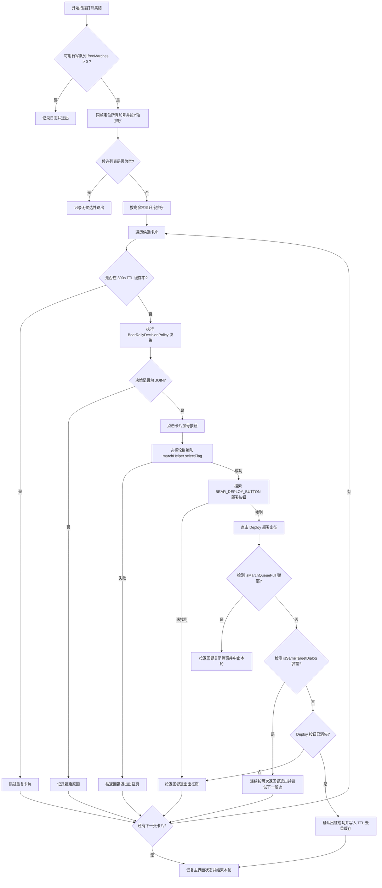
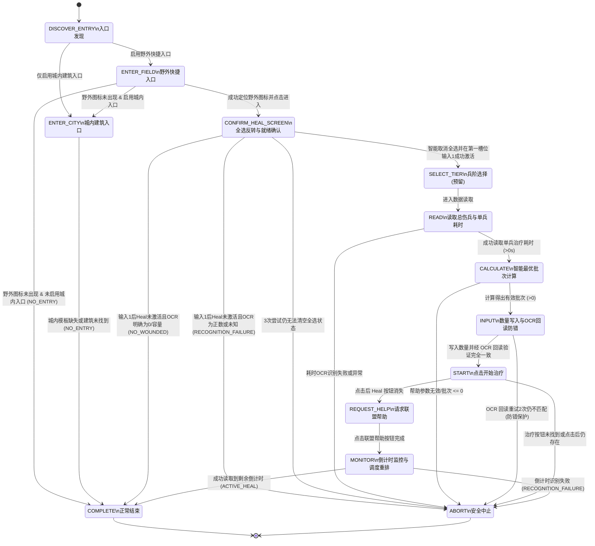

# Frostguard 自定义功能与上游差异权威文档 (Custom Features Specification)

> **文档性质**：本项目相对上游（Upstream Frostguard 官方仓库）所有自定义特性、行为差异、扩展逻辑与安全边界的**唯一权威事实来源（Single Source of Truth）**。
> **合并契约**：在上游代码合并（Upstream Merge）过程中，必须严格保留本文档记录的所有特性、配置键、UI 绑定、算法、状态机、持久化与自动化测试。严禁在合并冲突时私自删除或弱化自定义行为。

---

## 目录
1. [自定义功能总览矩阵 (Feature Inventory Matrix)](#1-自定义功能总览矩阵-feature-inventory-matrix)
2. [特性详解 1：打熊集结高级智能筛选与出征闭环](#2-特性详解-1打熊集结高级智能筛选与出征闭环)
3. [特性详解 2：医院智能批量治疗与防错回读机制](#3-特性详解-2医院智能批量治疗与防错回读机制)
4. [特性详解 3：手动集结安全检查与队列防御](#4-特性详解-3手动集结安全检查与队列防御)
5. [特性详解 4：通用紧凑数值解析引擎](#5-特性详解-4通用紧凑数值解析引擎)
6. [特性详解 5：运行时异常截图取证与脱敏存储](#6-特性详解-5运行时异常截图取证与脱敏存储)
7. [特性详解 6：一键启动脚本与运行环境契约](#7-特性详解-6一键启动脚本与运行环境契约)
8. [其他必须保护的自定义行为](#8-其他必须保护的自定义行为)
9. [自动化测试与验证证据清单](#9-自动化测试与验证证据清单)

---

## 1. 自定义功能总览矩阵 (Feature Inventory Matrix)

| 特性标识 | 对应模块与文件 | 功能定位与做什么的 | 上游原生行为 (Upstream) | 本 Fork 自定义行为 (Custom) | 验证级别 |
| --- | --- | --- | --- | --- | --- |
| **`BEAR_TRAP_ADVANCED_JOIN`** | `modules/tasks` • `BearTrapRoutine.java` • `BearRallyScanner.java` • `BearRallyDecisionPolicy.java` • `BearRallyDedupCache.java` | 打熊活动期间，对联盟集结列表进行单次捕获、多卡片 OCR 筛选；支持狂热放宽成员门槛、300s 活动实例级去重、6 编队轮换和部署确认。 | 普通路径只加入第一个可用集结。 | 候选保持从上到下顺序；局部复核成功后才推进编队，页面往返后废弃旧坐标。同帧相同签名及明确同目标使用“签名+纵坐标”5 秒短期抑制，其他成功候选使用 300 秒 TTL；日志不输出玩家名或完整签名，短期抑制不冒充成功部署。 | ✅ 自动化测试；⚠️ 待真实帧与实机日志 |
| **`HOSPITAL_HEAL`** | `modules/tasks` • `HospitalHealRoutine.java` • `HospitalPageEvidencePolicy.java` • `HealBatchCalculator.java` • `HospitalSchedulePolicy.java` `modules/desktop` • `HospitalLayoutController.java` | 自动执行伤兵分批治疗、联盟帮助和有界重排。 | 上游没有该状态机。 | 固定区域交互前必须由合法伤兵 OCR 或彩色 Heal 模板确认页面；页面确认时明确 `0/容量` 会在任何固定点击前退出。最大等待分钟数是防溢出的警告阈值，不会中断已开始的治疗。城内医院和加速由 UI 与运行时双重封闭，待英文真实帧验证后开放。 | ✅ 纯逻辑、模板映射与 FXML 测试；⚠️ 待真实帧与实机日志 |
| **`MANUAL_RALLY_JOIN`** | `modules/tasks` • `ManualRallyJoinRoutine.java` | 手动集结加入安全控制。 | 缺乏严格的编队数量规范化与防呆保护。 | 编队数限制 `[1,6]`；绿色 Join 校验；找不到保存编队或 Equalize 即退出；队列满、同目标或 Deploy 仍可见时均不登记出征。 | ✅ 自动化测试 |
| **`INTELLIGENCE_SAFETY`** | `modules/tasks` • `IntelligenceRoutine.java` | 情报任务零触屏关停、类型隔离和彩色/灰度双匹配。 | 上游流程不会覆盖这些分支保护。 | 主开关或全部子类型关闭时在打开页面前退出；普通与火晶模板隔离；误触后关闭遮罩并有界重试。 | ✅ 自动化测试；⚠️ 视觉证据仍需实机确认 |
| **`POLAR_TERROR_AUTOJOIN`** | `modules/tasks` • `PolarTerrorHuntingRoutine.java` • `AllianceAutojoinRoutine.java` | 极地恶魔与联盟自动集结扩展。 | 上游不含按目标 OCR 配置。 | 极地页签无法识别时保守退出；复选框截图失败时保持原状态；恢复上游即将重置 AutoJoin 的前瞻延迟和 7h50m 周期。 | ✅ 编译与既有策略测试；⚠️ 待真实帧 |
| **`MARCH_SINGLE_FRAME`** | `modules/automation` • `MarchHelper.java` | 一次打开队列、一次捕获并读取全部行军槽位。 | 多次打开或多次截图会产生状态漂移。 | `readMarchQueueSinglePass()` 综合颜色、模板与 OCR，`finally` 关闭面板，供情报和极地恶魔复用。 | ✅ 自动化测试 |
| **`ZH_CN_I18N`** | `modules/desktop` • `I18nService.java` | 简体中文自动本地化。 | 上游以英文为主。 | UTF-8 词典、动态文本属性监听、后加入节点翻译；保留业务控件已有 cell factory/converter，不覆盖定制显示逻辑。 | ✅ FXML 加载测试 |
| **`COMPACT_NUMBER_PARSER`** | `modules/vision` • `CompactGameNumberParser.java` | 支持整数、规范千分位及 `K/M`，非法格式或溢出返回 `-1`。 | 简单提取不能处理紧凑格式。 | 校验千分位结构并使用 `longValueExact()`，不截断、不回绕。 | ✅ 自动化测试 |
| **`EXCEPTION_SCREENSHOT`** | `modules/automation` • `ExceptionScreenshotService.java` | 本地异常画面证据。 | 异常仅有文本日志。 | 默认全帧 16px 像素化；不记录原始账号 ID 和原因文本；成对写入失败清理；7 天、100 文件、50MiB 三重上限。 | ✅ 自动化测试 |
| **`ONE_KEY_START_BAT`** | 根目录 • `一键启动挂机脚本.bat` | Windows 打包产物启动脚本。 | 上游主要提供 Maven 源码启动。 | 验证 PATH 中 Java 版本至少为 21，选择最新构建 JAR，并显式设置 UTF-8 JVM 编码；不会修改系统 Java 环境。 | ✅ 静态逻辑复核 |

---

## 2. 特性详解 1：打熊集结高级智能筛选与出征闭环

### 2.1 功能定位与业务目标
在《寒霜启示录》（Whiteout Survival）打熊活动（Bear Trap）中，玩家需要在有限的 30 分钟活动时间内尽可能多地加入高收益集结。
- **业务痛点**：
  1. 上游原生代码仅识别屏幕上的加号按钮并点击，无法感知集结当前是由谁发起、已有几人、剩余多少容量；
  2. 容易加入即将满员却只有 1~2 人的低加成车，或者加入总容量极小的车，导致伤害收益大打折扣；
  3. 出征过程中若行军队列已满或已有部队前往同一集结，容易卡在出征页面或不断重试，造成活动时间浪费。
- **功能目标**：
  - 实现对当前屏幕所有可用集结卡片的**同帧多维度解析**；
  - 允许玩家自定义“最低成员数”、“最低总容量”、“最低剩余容量”；
  - 提供“狂热模式”（Frenzy Mode），在活动最后阶段（默认 22 分钟后）自动放宽成员数门槛，全力将剩余行军队列派空；
  - 建立 300 秒分域 TTL 去重缓存与严格的出征部署闭环，遇阻安全回退且不误锁缓存。

### 2.2 核心算法与技术实现

#### (1) 同帧动态相对 ROI 扫描几何 (`BearRallyScanner`)
游戏列表页面支持滑动且卡片位置不固定。为防止多次截图导致的卡片位移与数据错配，`BearRallyScanner` 采用**单帧锚点相对偏移几何算法**：
1. 定位所有 `BEAR_JOIN_PLUS_ICON` 后保留控制器缓存帧，后续 OCR 全部复用该帧；匹配点 $P(x,y)$ 是模板中心，模板尺寸存在时先换算为匹配区域左上角；
2. 按照 Y 坐标升序排列（从上到下处理）；
3. 以加号按钮左上角坐标 $(P_x, P_y)$ 为基准，推导卡片内 4 组关键数据的 OCR 识别区域：

$$\begin{cases}
\text{Host (发起人 ROI)} &= [X_1: 281, X_2: 691, Y_1: P_y - 102, Y_2: P_y - 63] \\
\text{Members (成员数 ROI)} &= [X_1: 626, X_2: 688, Y_1: P_y - 57, Y_2: P_y - 24] \\
\text{Capacity (容量 ROI)} &= [X_1: 284, X_2: 521, Y_1: P_y - 57, Y_2: P_y - 25] \\
\text{Countdown (倒计时 ROI)} &= [X_1: 571, X_2: 691, Y_1: P_y - 163, Y_2: P_y - 124]
\end{cases}$$

- **兵量推导公式**：
  $$\text{currentTroops} = \text{totalCapacity} - \text{remainingCapacity}$$

#### (2) 复合签名与 TTL 去重缓存 (`BearRallyDedupCache`)
- **签名结构**：`{host}:members={cur}/{max}:troops={cur}/{tot}:remaining={rem}:completion={bucket}`
- **15秒归一化时间桶 (`completionBucket`)**：
  $$\text{bucket} = \left\lfloor \frac{T_{\text{observed}} + T_{\text{countdown}}}{15} \right\rfloor$$
  *设计意图*：集结倒计时每秒都在自然衰减，若直接将剩余秒数作为签名，下一秒就会被误判为全新集结。采用预计完成时刻的 15 秒时间桶，可确保同一集结在整个生命周期内签名保持绝对稳定。
- **缓存策略**：
  - 作用域隔离：`Scope(profileId, trapNumber + referenceTrapTime)`，多账号与不同活动场次互不干扰；
  - 容量上限：LRU 256 条，防止内存泄漏；
  - 有效期：300 秒 TTL，过期自动剔除；
  - 时钟保护：检测到系统时间回拨（>60s）时自动清空缓存，防止死锁。

#### (3) 决策评估引擎与狂热模式 (`BearRallyDecisionPolicy`)
- 评估输入：`BearRallyCandidate` 实体、玩家配置 Profile、活动开始时间 `referenceTrapTime`、系统时钟。
- **决策规则**：
  1. **有效性前置检查**：若发起人为空、容量解析失败（$\le 0$）或加号坐标为空，返回 `SKIP (Invalid candidate data)`；
  2. **狂热模式判定**：若开启狂热模式且当前时间距离活动开始 $\ge 22$ 分钟（`BEAR_TRAP_FRENZY_START_MINUTE_INT`），跳过成员数门槛检查；
  3. **常规成员数检查**：若未处于狂热模式，当前成员数必须 $\ge$ `BEAR_TRAP_MIN_MEMBER_COUNT_INT`；
  4. **总容量检查**：总容量必须 $\ge$ `BEAR_TRAP_MIN_RALLY_CAPACITY_INT`；
  5. **剩余容量检查**：剩余容量必须 $\ge$ `BEAR_TRAP_MIN_REMAINING_CAPACITY_INT`；
  6. 全部满足返回 `JOIN`，否则返回 `SKIP` 并附带具体拒绝原因。

#### (4) 完整出征部署闭环与弹窗安全拦截

### 2.3 配置项清单矩阵

| 配置键 (ConfigurationKeyEnum) | 数据类型 | 默认值 | 归属面板 | 业务含义与配置建议 |
| --- | --- | --- | --- | --- |
| `BEAR_TRAP_ADVANCED_JOIN_ENABLED_BOOL` | Boolean | `false` | 打熊面板 | 打熊高级加入总开关。开启后启用卡片 OCR 扫描与智能决策；关闭时保持上游盲点加号模式。 |
| `BEAR_TRAP_MIN_MEMBER_COUNT_INT` | Integer | `0` | 打熊面板 | 加入集结的最低已有成员数门槛（例如设为 3，则只有当前已有 $\ge 3$ 人的车才会加入）。 |
| `BEAR_TRAP_MIN_RALLY_CAPACITY_INT` | Integer | `0` | 打熊面板 | 加入集结的最低总容量门槛（例如设为 `500000`，过滤小容量发起人）。 |
| `BEAR_TRAP_MIN_REMAINING_CAPACITY_INT` | Integer | `0` | 打熊面板 | 加入集结的最低剩余容量门槛（例如设为 `50000`，防止刚点进去就被别人挤满）。 |
| `BEAR_TRAP_FRENZY_MODE_ENABLED_BOOL` | Boolean | `false` | 打熊面板 | 狂热模式开关。开启后在活动末期自动放宽成员数限制，全力出兵。 |
| `BEAR_TRAP_FRENZY_START_MINUTE_INT` | Integer | `22` | 打熊面板 | 狂热模式生效时间点（活动开始后第几分钟激活，默认第 22 分钟）。 |
| `BEAR_TRAP_JOIN_MARCH_1_FLAG_STRING` ~ `6` | String | `"No Flag"` | 打熊面板 | 6 路出征队列独立绑定的预设编队名称（Flag 1 ~ Flag 6 轮换出征）。 |

---

## 3. 特性详解 2：医院智能批量治疗与防错回读机制

### 3.1 功能定位与业务目标
在《寒霜启示录》中，联盟帮助（Alliance Help）每次可按百分比或固定时间减少治疗耗时。若一次性治疗全部伤兵（通常需要几十小时），联盟帮助只能抵扣微小的一部分；而如果将伤兵**分成小批次**（使每批治疗时间刚好等于联盟帮助最大减免总时间），则可以通过盟友秒点帮助实现“**零加速/零等待伤兵秒清**”。
- **业务痛点**：
  1. 游戏打开医院界面时默认会**勾选全选所有伤兵**，导致总时长极大；
  2. 若手动或脚本误将全部伤兵送入治疗，将占用医院数十小时，阻碍后续自动循环；
  3. 模拟器输入框可能因键盘弹起、卡顿或输入法丢失字符，导致输入的数量不符合预期；
  4. 治疗完成后缺乏精准倒计时感知，盲目高频轮询会浪费 CPU 和模拟器性能。
- **功能目标**：
  - 野外快捷入口已接入；城内入口等待真实帧和模板，当前不会用固定坐标盲点；
  - 自动将游戏默认的全选状态反转清零，并在第一兵种输入框输入 `1` 激活治疗按钮；
  - 读取伤兵总数，基于盟友帮助次数与单次减免时长，精准计算单批次最优治疗数量；
  - 写入数量后执行 **OCR 回读校验**，不一致时自动重试，重试失败安全中止，绝不盲目出兵；
  - 获取治疗倒计时并在 `HospitalSchedulePolicy` 中实行有界延时重排，杜绝死循环刷屏。

### 3.2 核心算法与状态机流转

#### (1) 医院状态转换状态机 (State Machine)
整个治疗过程由 11 个显式状态严格驱动，并受 20 步安全计数器保护，杜绝死循环：

#### (2) 页面身份确认与全选状态智能反转机制
1. 打开医院弹窗后等待 2500ms 待动画完成；
2. 固定区域点击前必须满足至少一项医院页面强证据：伤兵区域 OCR 是合法的 `当前值/容量`（`0 <= 当前值 <= 容量` 且 `容量 > 0`），或彩色 `HOSPITAL_HEAL_BUTTON` 存在；入口消失不能单独证明页面身份，没有强证据时进入 `ABORT`；
3. 循环最多 3 次检测 `HOSPITAL_HEAL_BUTTON` 模板：
   - 若匹配度 $\ge 70\%$（按钮为彩色，说明游戏默认勾选了全部伤兵）：点击快速选择切换点 `PointData(134, 852)` 清零所有兵种选择，等待 1500ms；
   - 直至 Heal 按钮变为灰色（模板匹配失败），确认选择已清空；
   - 若 3 次尝试后仍为彩色，判定为页面异常，立即切换至 `ABORT`；
4. 点击第一兵种输入框 `TROOP_1_INPUT_BOX_CENTER (590, 390)`，清除原内容并写入 `1\n`，点击空白区域 `(360, 320)` 收起软键盘；
5. 重新检测 `HOSPITAL_HEAL_BUTTON`：若此时按钮亮起，说明已成功就绪，记录按钮坐标进入 `READ`；若仍未亮起，仅当伤兵 OCR 明确为合法 `0/容量` 时设置 `runOutcome = NO_WOUNDED`，正数伤兵或未知 OCR 均以 `RECOGNITION_FAILURE` 安全退出并退避。

#### (3) 智能批次计算公式 (`HealBatchCalculator`)
- 联盟帮助最大减免总时长：
  $$T_{\text{help}} = \text{helpCount} \times \text{reductionSec}$$
  *(默认：$15 \times 210 = 3150$ 秒 $\approx 52.5$ 分钟)*
- **精确模式批次**（当通过 `HOSPITAL_WOUNDED_COUNT_OCR_AREA` 置信读取到 $\text{totalWounded} > 0$ 时）：
  $$\text{batchSize} = \max\left(1, \min\left(\text{totalWounded}, \left\lfloor \frac{T_{\text{help}}}{\text{singleTroopTimeSec}} \right\rfloor\right)\right)$$
- **兼容模式批次**（当伤兵总数读取失败时）：
  $$\text{batchSize} = \max\left(1, \left\lfloor \frac{T_{\text{help}}}{\text{singleTroopTimeSec}} \right\rfloor\right)$$

#### (4) 数量写入 OCR 回读防错机制
为彻底杜绝因模拟器卡顿导致写入错误数量（例如误将 500 写成 50000），`INPUT` 阶段引入严格的**双重重试与回读核验**：
1. 点击输入框，执行 `clearText` 并 `writeText(String.valueOf(batchedAmountToHeal) + "\n")`；
2. 点击空白区域收起键盘；
3. 调用 `provider.extractText` 识别输入框区域 `[540, 360, 640, 420]` 的文字；
4. 解析出数字 `readBackVal`：
   - 若 `readBackVal == batchedAmountToHeal`：核验通过，进入 `START`；
   - 若 OCR 返回有效数值但不一致：记录警告并重试清空写入（最多 2 次），仍不一致则 `ABORT`；
   - 若 OCR 无法返回有效数值：只有彩色 Heal 按钮已经出现时才走基础兼容路径，否则 `ABORT`；
   - 点击 Heal 后必须确认按钮消失，否则不进入联盟帮助和倒计时监控。

#### (5) 倒计时监控与调度重排策略 (`HospitalSchedulePolicy`)
在治疗开始并点击联盟帮助后，等待 30 秒使盟友帮助生效，随后在 `CommonGameAreas.HOSPITAL_HEAL_TIME_OCR_AREA`（`[463, 849, 610, 885]`）读取当前剩余时间，并根据退出状态精确重排下次执行时间：

| 退出状态 (`Outcome`) | 重排延迟计算公式 | 业务设计理由 |
| --- | --- | --- |
| `ACTIVE_HEAL` | $\text{remainingSec} + 30\text{s}$（无倒计时则回退 15 分钟） | 治疗正在进行中，精准等待本批完成并充分利用帮助后再开启下一批。 |
| `NO_WOUNDED` | 由每日任务调度器按正常周期轮询 | 医院当前无伤兵，无需高频无效运行。 |
| `NO_ENTRY` | 由每日任务调度器按正常周期轮询 | 野外/城内图标暂不可见，等待下个周期。 |
| `RECOGNITION_FAILURE` | 固定退避 15 分钟 (`now + 15m`) | 视觉或回读异常，退避防死循环刷屏。 |
| `CONFIGURATION_UNSUPPORTED`| 固定长退避 60 分钟 (`now + 60m`) | 两个入口均关闭或参数非法，避免无效唤醒。 |

### 3.3 配置项清单矩阵

| 配置键 (ConfigurationKeyEnum) | 数据类型 | 默认值 | 归属面板 | 业务含义与配置建议 |
| --- | --- | --- | --- | --- |
| `HOSPITAL_HEAL_ENABLED_BOOL` | Boolean | `false` | 城市面板 | 医院自动分批治疗总开关。 |
| `HOSPITAL_HEAL_FIELD_ENABLED_BOOL` | Boolean | `true` | 城市面板 | 野外快捷图标入口开关（出城后界面左侧十字图标）。 |
| `HOSPITAL_HEAL_CITY_ENABLED_BOOL` | Boolean | `false` | 城市面板 | 预留城内医院入口；当前缺少真实模板，保持禁用且不执行盲点。 |
| `HOSPITAL_HEAL_MAX_WAIT_MINUTES_INT` | Integer | `30` | 城市面板 | 单批治疗剩余时间的警告阈值；超过时仅记录警告并按实际剩余时间调度，不中断已开始的治疗。 |
| `ALLIANCE_HELP_MAX_COUNT_INT` | Integer | `15` | 联盟面板 | 联盟最大帮助次数（用于估算单批最大减免时长）。 |
| `ALLIANCE_HELP_TIME_REDUCTION_SEC_INT` | Integer | `210` | 联盟面板 | 每次联盟帮助减少的秒数（默认 210 秒 = 3.5 分钟）。 |
| `HOSPITAL_HEAL_USE_SPEEDUP_BOOL` | Boolean | `false` | 城市面板 | 治疗加速道具开关（**目前安全禁用**，待获取纯道具支付校验素材后开放）。 |
| `HOSPITAL_HEAL_MAX_SPEEDUP_MINUTES_INT` | Integer | `60` | 城市面板 | 单批允许使用的最大加速分钟数。 |

---

## 4. 特性详解 3：手动集结安全检查与队列防御

### 4.1 功能定位与业务目标
在日常手动集结加入（`ManualRallyJoinRoutine`）过程中，防止用户配置的编队越界，并在加入时提供绿色像素判定与部署弹窗防御。

### 4.2 核心实现
1. **编队数量防御性校验**：读取 `RALLY_MARCHES_INT` 后由 `normalizeMarchLimit` 严格限制在 `[1, 6]` 范围内，防止数组越界与非法参数；
2. **绿色像素检测**：点击集结列表时检测加号是否处于可用绿色状态；
3. **编队选择完整性**：配置保存编队时，选择失败立即退出；未配置保存编队时，必须识别并点击 Equalize，找不到 Equalize 不得继续部署；
4. **出征弹窗拦截**：出征后调用 `deploymentHelper.isMarchQueueFull()` 和 `deploymentHelper.isSameTargetDialog()` 拦截异常弹窗，遇阻时自动按返回键恢复；
5. **正向成功证据**：无阻断弹窗仍不等于成功；只有 `RALLY_DEPLOY_BUTTON` 已消失时才登记行军和占用槽位。

---

## 5. 特性详解 4：通用紧凑数值解析引擎

### 5.1 功能定位与业务目标
游戏内 UI 广泛采用紧凑格式表示数值（例如 `50.0K`、`1.2M`、`1,234,567`）。Java 原生 `Long.parseLong` 无法直接处理此类字符串。
- `CompactGameNumberParser` 提供了统一的静态解析工具 `parseCompactNumber(String raw)`。

### 5.2 核心规则
1. **空白与空字符处理**：`null` 或去除空格后为空字符串时返回 `-1`；
2. **千分位格式校验**：只接受 `1,234`、`1,234,567` 等规范分组，`1,2,3`、`12,34` 直接返回 `-1`，校验后才移除逗号；
3. **单位后缀解析**：
   - 包含 `K` 或 `k`：按浮点数解析前缀并乘以 `1,000`；
   - 包含 `M` 或 `m`：按浮点数解析前缀并乘以 `1,000,000`；
4. **防溢出与负数保护**：计算结果如果超过 `Long.MAX_VALUE` 或出现非数字字符，安全捕获异常并返回 `-1`。

---

## 6. 特性详解 5：运行时异常截图取证与脱敏存储

### 6.1 功能定位与业务目标
在自动化运行过程中，当 OCR 识别失败、模板未找到或状态机发生异常中止时，纯文本日志难以直观还原现场画面。
- `ExceptionScreenshotService` 在捕获到特定运行时异常时，自动通过 ADB 截取当前屏幕，并保存为 PNG 图片。

### 6.2 隐私与存储契约
1. **保存路径**：工作区本地目录 `logs/screenshots/`，文件名只含时间、随机证据 ID 和清洗后的任务类别；
2. **图像脱敏**：完整画面默认做 16px 块状像素化，不保存可直接阅读的玩家名、联盟名、聊天与数值文本；
3. **metadata 最小化**：不写原始 profile ID 和异常原因文本，仅保留任务类别与原因摘要；
4. **原子性**：图片和 metadata 先写临时文件，部分失败时删除另一侧，避免孤立证据；
5. **容量控制**：只清理由本服务生成的 `exception_*` 文件，同时限制 7 天、100 个文件和 50MiB，不触碰同目录中的人工参考图；严禁上传外网或提交到 Git。

---

## 7. 特性详解 6：一键启动脚本与运行环境契约

### 7.1 脚本定位
位于代码仓库根目录的 [`一键启动挂机脚本.bat`](../一键启动挂机脚本.bat)，为 Windows 用户提供开箱即用的一键启动体验。

脚本验证 PATH 中 Java 主版本至少为 21，从多个构建产物中选择修改时间最新的桌面 JAR，并显式传入 UTF-8 JVM 编码参数。它不会安装 JDK，也不会修改系统级 `JAVA_HOME`。

### 7.2 同步契约
- 每当修改项目的版本号（如 `3.0.0`）、模块目录结构、打包输出路径（`packaging/desktop/target/`）或 Java 启动参数（如 `-Dfile.encoding=UTF-8`、JavaFX 模块路径）时，**必须同步更新该批处理脚本**，确保与最新打包结构保持 100% 一致。

---

## 8. 其他必须保护的自定义行为

### 8.1 情报任务安全熔断

`IntelligenceRoutine` 在主开关关闭或所有子类型关闭时，于打开侧栏和情报页之前退出；运行循环每轮重新读取主开关，运行中关闭后不再继续触屏。2026-08-19 上游新增的 Daily 侧栏可用数量、已打开侧栏的行军快照、真实帧模板、部署前 OCR 证据和多时代模板回退已完整接入；独立容量检查仍使用 `readMarchQueueSinglePass()`。普通野兽与火晶野兽配置保持隔离，View 按钮区域限制及误触遮罩恢复继续保留。

### 8.2 极地恶魔与联盟自动集结

极地恶魔搜索必须先识别目标页签；模板失败时退出，禁止恢复固定坐标兜底。联盟自动集结按 OCR 切片识别极地恶魔、吉娜和佣兵目标及进度；截图或颜色检查失败时复选框状态为“未知”，必须保持不变。执行前保留上游 `AutojoinActivationPolicy` 前瞻延迟，成功后的正常周期为 7 小时 50 分钟。

### 8.3 行军队列单次快照

`MarchHelper.readMarchQueueSinglePass()` 只打开一次队列面板、捕获一次画面并读取全部槽位，最后在 `finally` 关闭面板。槽位分类综合颜色、模板和倒计时 OCR；情报和极地恶魔等调用方必须复用结构化结果，不能退回多次开关面板。

### 8.4 简体中文界面本地化

`I18nService` 加载 UTF-8 中文词典，翻译初始场景树、后加入节点和已注册控件的动态文本属性。未命中文本保留英文。业务控件已有的 `cellFactory`、`buttonCell` 或 `converter` 必须保留，自动翻译不得覆盖。

---

## 9. 自动化测试与验证证据清单

纯逻辑和加载路径具有自动化测试；视觉坐标、OCR 阈值和真实页面转换仍必须使用保存帧与实机日志验证。每次修改后至少运行受影响模块测试，跨模块修改运行桌面 Reactor 测试。

| 测试类 (Test Class) | 归属模块 | 覆盖特性 | 核心测试场景与用例 |
| --- | --- | --- | --- |
| `BearRallyScannerTest` | `modules/tasks` | 打熊扫描器 | • 0 候选安全返回 • 最多 8 个候选与屏幕顺序 • 容量不改变候选方向 • 重复命中合并和越界过滤 • 候选消失、相邻顶替与新帧替换 • ROI、数值转换与真实按钮矩形保留 |
| `BearRallyCandidateTest` | `modules/tasks` | 打熊候选模型 | • 复合签名跨秒倒计时衰减稳定性验证（15s时间桶） |
| `BearRallyDecisionPolicyTest` | `modules/tasks` | 打熊决策策略 | • 三类门槛 • 狂热只放宽成员门槛 • 损坏数据安全跳过 |
| `BearRallyDedupCacheTest` | `modules/tasks` | 打熊去重缓存 | • 活动分域 • 300 秒 TTL • LRU • 60 秒回拨容差 • 同签名冲突排除 • 不同纵坐标短期位置键隔离 |
| `HealBatchCalculatorTest` | `modules/tasks` | 医院批次计算 | • 精确模式伤兵总数截断 `[1, totalWounded]` • 兼容模式批次计算 • 超大数值防溢出保护 • 非法单兵耗时异常保护 |
| `HospitalPageEvidencePolicyTest` | `modules/tasks` | 医院页面证据 | • 合法/非法伤兵结构 • 页面强证据 • 明确零伤兵 • 模板或 OCR 不明时识别失败 |
| `HospitalHealRoutineTest` | `modules/tasks` | 医院总开关 | • 关闭时在视觉、导航和模拟器交互前直接返回 |
| `HospitalSchedulePolicyTest` | `modules/tasks` | 医院调度策略 | • 所有退出状态精确重排 • 进行中倒计时加 30s 缓冲 • 零、负、超长持续时间退避 • 未来时间封顶 • 最大等待警告阈值防溢出 |
| `ManualRallyJoinRoutineTest` | `modules/tasks` | 手动集结 | • 编队范围 `[1,6]` • 部署必须有正向页面转换证据 |
| `CompactGameNumberParserTest`| `modules/vision` | 紧凑数值解析 | • `K/M` • 规范千分位 • 非法分隔与 long 溢出返回 `-1` |
| `ExceptionScreenshotServiceTest` | `modules/automation` | 异常证据 | • 有效 PNG • 全帧像素化 • metadata 最小化 • 7 天清理 |
| `FxmlLoadabilityTest` | `modules/desktop` | 桌面界面 | • FXML 资源存在性；控制器字段和处理器绑定由 `FxmlControllerBindingTest` 检查 |
| `HospitalUnsupportedFeaturesTest` | `modules/desktop` | 医院安全 UI | • 城内医院禁用 • 治疗加速禁用 • 野外医院配置仍可用 |

### 9.1 最新验证执行记录
- **执行时间**：2026-08-19
- **环境**：OpenJDK 21 (Temurin-21.0.12), Windows 11 PowerShell
- **执行命令**：使用本机 Maven 3.9.16、Java 21 运行 `modules/desktop -am` 定向回归；项目 Maven Wrapper 在当前 PowerShell 环境仍有启动故障。
- **已完成证据**：合并 `upstream/main@24795a0` 后，`modules/desktop -am test` 完整通过；当前 Surefire 报告合计 594 个测试，0 失败、0 错误、0 跳过，包含新增真实帧回归、自定义功能测试与 `FxmlLoadabilityTest`。
- **未完成证据**：没有 `720x1280` 未缩放真实帧，没有实机账号日志；高级打熊与医院不得据此标记为实机可用。

### 9.2 Windows 打包 CI 同步验证记录
- **执行时间**：2026-08-19
- **验证范围**：合并 `upstream/main@7d0e8f3` 后运行 `build-support/verification` 全部 Python 单元测试。
- **已完成证据**：47 个测试全部通过，覆盖 Stable/Nightly 渠道选择器、工作流契约与打包产物校验逻辑。
- **边界**：本次上游提交未改动 Java 模块、任务状态机、视觉模板或运行时行为，因此没有重复执行桌面 Reactor 测试，也不改变现有真实帧与实机日志的未验证状态。

### 9.3 打熊多卡片扫描验证记录
- **执行时间**：2026-08-19
- **定向验证**：`BearRallyScannerTest`、`BearRallyCandidateTest`、`BearRallyDecisionPolicyTest` 和 `BearRallyDedupCacheTest` 共 17 个测试通过。
- **回归验证**：tasks Reactor 在排除当前 Windows 进程环境下会读取空 PID 的既有 `BoundedProcessRunnerTest` 后，共 440 个测试通过，0 失败、0 错误、0 跳过。
- **证据边界**：尚无同时显示多个可加入卡片的 `720x1280` 原始帧，无法据此确认加号模板的真实重复距离、OCR 相对区域和点击后列表变化；医院 Heal 模板仍含动态倒计时且没有遮罩。

### 9.4 医院页面证据收紧验证记录
- **执行时间**：2026-08-19
- **定向验证**：`HospitalPageEvidencePolicyTest`、`HealBatchCalculatorTest` 和 `HospitalSchedulePolicyTest` 共 19 个测试通过。
- **回归验证**：tasks Reactor 在排除当前 Windows 进程环境下会读取空 PID 的既有 `BoundedProcessRunnerTest` 后，共 444 个测试通过，0 失败、0 错误、0 跳过。
- **证据边界**：本次只证明错误状态会在固定区域交互前安全退出，并正确区分明确零伤兵与识别失败；没有英文 `720x1280` 原始帧和实机日志，不能据此宣称医院视觉流程可用。总开关已有代码早退，但尚无直接验证零截图、零 OCR、零触屏的例程交互测试。

### 9.5 打熊候选顺序与旧坐标失效验证记录
- **执行时间**：2026-08-19
- **定向验证**：`BearRallyScannerTest`、`BearRallyCandidateTest`、`BearRallyDecisionPolicyTest` 和 `BearRallyDedupCacheTest` 共 20 个测试通过。
- **回归验证**：tasks Reactor 在排除当前 Windows 进程环境下会读取空 PID 的既有 `BoundedProcessRunnerTest` 后，共 447 个测试通过，0 失败、0 错误、0 跳过。
- **证据边界**：自动化测试证明新扫描不会保留已消失或被相邻卡片顶替的候选，代码路径在局部复核失败和页面返回后均废弃旧集合；尚无英文真实帧和实机日志，不能确认游戏列表动画结束所需等待时间。

### 9.6 去重碰撞与医院调度边界验证记录
- **执行时间**：2026-08-19
- **定向验证**：打熊扫描、决策、候选、去重和医院页面、批次、调度策略共 45 个测试通过。
- **回归验证**：tasks Reactor 在排除当前 Windows 进程环境下会读取空 PID 的既有 `BoundedProcessRunnerTest` 后，共 453 个测试通过，0 失败、0 错误、0 跳过。
- **证据边界**：同帧完全相同签名因缺少游戏提供的唯一集结 ID，采用“不参与 TTL 去重”的保守策略以避免漏掉另一辆；真实页面中同签名候选的出现频率、列表变化和部署结果仍需英文原始帧及实机日志验证。

### 9.7 未支持医院能力门禁验证记录
- **执行时间**：2026-08-19
- **定向验证**：`TemplatesEnumTest`、医院页面/批次/调度策略、`FxmlLoadabilityTest` 和 `HospitalUnsupportedFeaturesTest` 共 28 个测试通过。
- **回归验证**：tasks Reactor 共 456 个测试通过，0 失败、0 错误、0 跳过。完整 Desktop Reactor 首次运行仅在无关的 `WindowsInstallerHandoffTest` Windows 进程时序用例失败；该测试随后单独复跑 6 个用例全部通过。
- **证据边界**：城内医院与治疗加速已经从 UI 和运行时双重封闭，但野外治疗视觉流程仍缺英文 `720x1280` 原始帧与实机日志，不能宣称医院自动治疗已具备实机可用证据。

### 9.8 双轮审查修复与复审记录
- **执行时间**：2026-08-19
- **修复内容**：明确零伤兵在固定点击前退出；候选局部复核成功后才推进编队；同签名和同目标使用 5 秒位置抑制；最大等待配置明确为防溢出的警告阈值；修正 FXML 测试证据描述。
- **定向验证**：打熊、医院、模板与医院 UI 共 53 个测试通过；随后 `FxmlLoadabilityTest`、`FxmlControllerBindingTest` 和 `HospitalUnsupportedFeaturesTest` 共 6 个测试通过。
- **回归验证**：tasks Reactor 在排除当前 Windows 进程环境下会读取空 PID 的既有 `BoundedProcessRunnerTest` 后，共 460 个测试通过，0 失败、0 错误、0 跳过；`git diff --check` 通过。
- **复审结论**：第三轮发现并补齐“同目标”短期抑制；第四轮未发现新的代码级控制流缺陷。没有英文真实帧与实机日志，因此视觉模板分数、点击坐标和页面动画时序仍保持未验证状态。

### 9.9 上游 `3.0.2` 合并后验证记录
- **执行时间**：2026-08-19
- **回归验证**：合并 `upstream/main@0fe7b2a` 后，tasks Reactor 在排除当前 Windows 进程环境下会读取空 PID 的既有 `BoundedProcessRunnerTest` 后，共 460 个测试通过，0 失败、0 错误、0 跳过；构建使用并验证了新的 `3.0.2` Reactor 版本。
- **打包验证边界**：本机仅存在 Microsoft Store 的 Python 占位程序，无法启动解释器，因此本次未执行 `build-support/verification` Python 套件；该项是环境未验证，不记为测试通过或产品失败。
- **完整性复核**：上游差异仅涉及 Windows 发布工作流、打包与验证脚本、发布文档和根版本号；未覆盖清单中的自定义任务、配置、UI、模板、持久化或调度实现。一键启动脚本的版本无关 JAR 选择逻辑仍与 `3.0.2` 输出兼容。

## 10. 最近一次上游同步

- **上游基线**：`upstream/main` 的 `0fe7b2a`（2026-08-19）。
- **上游内容**：项目版本升级至 `3.0.2`；Stable 安装包改为注入并校验已被系统接受的 Nightly 启动器字节，同时继续使用独立的 Stable JVM 配置、应用标识、更新源和工作区；相应更新 Windows 发布工作流、打包验证脚本及架构、发布和 Windows 文档。
- **冲突处理**：本次上游提交与任务逻辑、自定义配置、桌面 UI、视觉模板及自定义文档没有文件冲突，使用 `ort` 策略无冲突合并；上一基线中的情报整合以及打熊、医院等后续自定义实现保持不变。
- **一键启动兼容性**：脚本不硬编码项目版本，而是从 `packaging/desktop/target/input` 按修改时间选择 `frostguard-desktop-*.jar`，因此兼容 `3.0.2` 版本及本次未改变的打包输出结构和 Java 启动参数，无需修改脚本。
- **完整性结论**：本次上游没有修改任务生命周期、配置键、UI 入口、模板资产、持久化、调度或自动化安全兜底；清单中的全部自定义功能均保留。合并后的实际验证结果见本节后续记录；既有真实画面与实机日志证据边界不因本次合并而改变。
