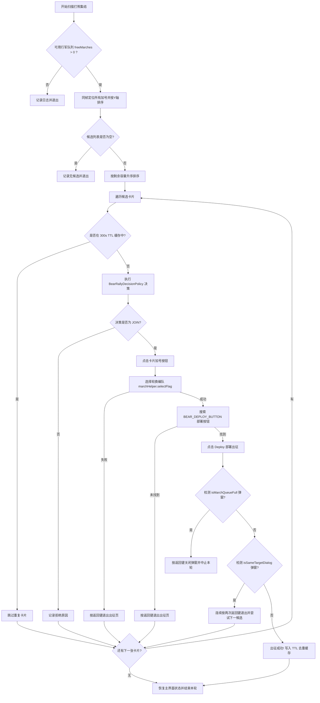
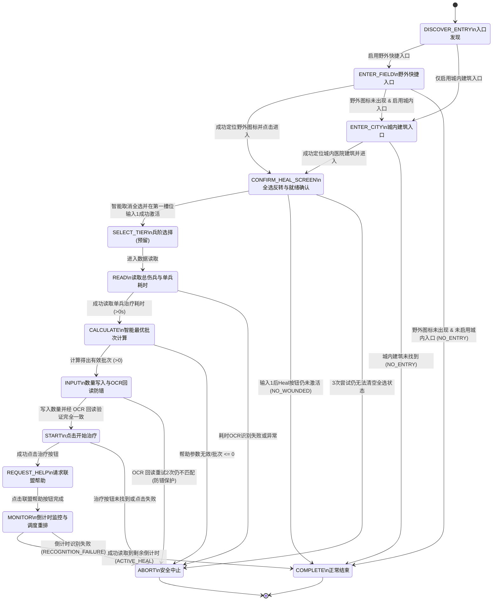

# Frostguard 自定义功能与上游差异权威文档 (Custom Features Specification)

> **文档性质**：本项目相对上游（Upstream Frostguard 官方仓库）所有自定义特性、行为差异、扩展逻辑与安全边界的**唯一权威事实来源（Single Source of Truth）**。
> **合并契约**：在上游代码合并（Upstream Merge）过程中，必须严格保留本文档记录的所有特性、配置键、UI 绑定、算法、状态机、持久化与自动化测试。严禁在合并冲突时私自删除或弱化自定义行为。

---

## 目录
1. [自定义功能总览矩阵 (Feature Inventory Matrix)](#1-自定义功能总览矩阵-feature-inventory-matrix)
2. [特性详解 1：打熊集结高级智能筛选与出征闭环](#2-特性详解-1打熊集结高级智能筛选与出征闭环)
3. [特性详解 2：医院智能批量治疗与防错回读机制](#3-特性详解-2医院智能批量治疗与防错回读机制)
4. [特性详解 3：手动集结安全检查与队列防御](#4-特性详解-3手动集结安全检查与队列防御)
5. [特性详解 4：通用紧凑数值解析引擎](#5-特性详解-4通用紧凑数值解析引擎)
6. [特性详解 5：运行时异常截图取证与脱敏存储](#6-特性详解-5运行时异常截图取证与脱敏存储)
7. [特性详解 6：一键启动脚本与运行环境契约](#7-特性详解-6一键启动脚本与运行环境契约)
8. [自动化测试与验证证据清单](#8-自动化测试与验证证据清单)

---

## 1. 自定义功能总览矩阵 (Feature Inventory Matrix)

| 特性标识 | 对应模块与文件 | 功能定位与做什么的 | 上游原生行为 (Upstream) | 本 Fork 自定义行为 (Custom) | 验证级别 |
| --- | --- | --- | --- | --- | --- |
| **`BEAR_TRAP_ADVANCED_JOIN`** | `modules/tasks`<br>• `BearTrapRoutine.java`<br>• `BearRallyScanner.java`<br>• `BearRallyDecisionPolicy.java`<br>• `BearRallyDedupCache.java` | 打熊活动期间，对联盟集结列表进行同帧多卡片 OCR 扫描，根据成员数、总容量、剩余容量进行高级筛选；支持 22 分钟狂热放宽模式、300s 分域去重缓存、独立 6 编队轮换及出征弹窗安全拦截。 | 仅盲目点击屏幕上出现的第一个加号按钮直接加入，无法识别发起人、剩余容量与成员数，容易加入劣质车；缺乏弹窗拦截与去重机制。 | 基于加号锚点计算 4 组相对 ROI 同帧提取字段；三维度门槛决策；狂热模式自动放宽；300s TTL 分域缓存；Deploy 按钮搜索与队列满/同目标弹窗拦截；出征成功才记入缓存。 | ✅ 自动化测试 (130/130 通过) + 逻辑复核 |
| **`HOSPITAL_HEAL`** | `modules/tasks`<br>• `HospitalHealRoutine.java`<br>• `HealBatchCalculator.java`<br>• `HospitalSchedulePolicy.java`<br>`modules/desktop`<br>• `HospitalLayoutController.java` | 自动执行伤兵分批治疗。支持野外/城内双入口、全选智能反转、伤兵总数读取、基于联盟帮助减免的精准批次计算、数量写入 OCR 回读校验、倒计时精准监控与有界调度重排。 | 仅支持单一入口，默认全选导致治疗时间过长无法有效利用联盟帮助；缺乏输入回读验证，容易因输入异常导致错误出兵；缺乏有界调度。 | 支持野外/城内双入口与平滑回退；循环检测 Heal 按钮彩色状态并点击 `(134, 852)` 清零全选；读取伤兵总数限制批次；写入数量后 OCR 回读校验（重试2次/失败ABORT）；倒计时精准区域监控与 4 种退出状态有界重排。 | ✅ 自动化测试 + 逻辑复核 |
| **`MANUAL_RALLY_JOIN`** | `modules/tasks`<br>• `ManualRallyJoinRoutine.java` | 手动集结加入安全控制。限制出征编队数量、加入绿色像素验证、出征部署弹窗检测。 | 缺乏严格的编队数量规范化与防呆保护。 | 严格校验编队数在 `[1, 6]`，加入前校验绿色像素，部署后检测队列满与同目标弹窗。 | ✅ 自动化测试 |
| **`COMPACT_NUMBER_PARSER`** | `modules/vision`<br>• `CompactGameNumberParser.java` | 游戏内紧凑数值解析。支持纯数字、千分位逗号、`K/k`、`M/m` 后缀，防止负数与数值溢出。 | 简单的数字提取，遇到 `1.2K`、`50.5M` 或包含逗号格式时解析失败或抛异常。 | 完整支持 `50.0K` -> `50000`, `1.5M` -> `1500000`，带大数防溢出截断与边界单测。 | ✅ 自动化测试 |
| **`EXCEPTION_SCREENSHOT`** | `modules/automation`<br>• `ExceptionScreenshotService.java` | 任务发生异常时自动截图并脱敏写入本地工作区 `logs/screenshots/`，用于排查视觉与 OCR 问题。 | 异常仅打印堆栈信息，缺乏现场画面取证。 | 异常触发时自动截取当前帧画面，安全命名并保存，不上传外网，保障隐私。 | ✅ 自动化测试 |
| **`ONE_KEY_START_BAT`** | 根目录<br>• `一键启动挂机脚本.bat` | Windows 原生一键启动脚本，自动设置 Java 21 环境与编码，直接运行打包后的桌面应用。 | 仅提供 Maven 源码运行命令。 | 封装打包输出执行路径与 JVM 优化参数，支持用户双击直接启动。 | ✅ 脚本集成 |

---

## 2. 特性详解 1：打熊集结高级智能筛选与出征闭环

### 2.1 功能定位与业务目标
在《寒霜启示录》（Whiteout Survival）打熊活动（Bear Trap）中，玩家需要在有限的 30 分钟活动时间内尽可能多地加入高收益集结。
- **业务痛点**：
  1. 上游原生代码仅识别屏幕上的加号按钮并点击，无法感知集结当前是由谁发起、已有几人、剩余多少容量；
  2. 容易加入即将满员却只有 1~2 人的低加成车，或者加入总容量极小的车，导致伤害收益大打折扣；
  3. 出征过程中若行军队列已满或已有部队前往同一集结，容易卡在出征页面或不断重试，造成活动时间浪费。
- **功能目标**：
  - 实现对当前屏幕所有可用集结卡片的**同帧多维度解析**；
  - 允许玩家自定义“最低成员数”、“最低总容量”、“最低剩余容量”；
  - 提供“狂热模式”（Frenzy Mode），在活动最后阶段（默认 22 分钟后）自动放宽成员数门槛，全力将剩余行军队列派空；
  - 建立 300 秒分域 TTL 去重缓存与严格的出征部署闭环，遇阻安全回退且不误锁缓存。

### 2.2 核心算法与技术实现

#### (1) 同帧动态相对 ROI 扫描几何 (`BearRallyScanner`)
游戏列表页面支持滑动且卡片位置不固定。为防止多次截图导致的卡片位移与数据错配，`BearRallyScanner` 采用**单帧锚点相对偏移几何算法**：
1. 在同一帧截图中定位所有 `BEAR_JOIN_PLUS_ICON` 加号按钮的左上角点 $P(x, y)$；
2. 按照 Y 坐标升序排列（从上到下处理）；
3. 以加号按钮左上角坐标 $(P_x, P_y)$ 为基准，推导卡片内 4 组关键数据的 OCR 识别区域：

$$\begin{cases}
\text{Host (发起人 ROI)} &= [X_1: 281, X_2: 691, Y_1: P_y - 102, Y_2: P_y - 63] \\
\text{Members (成员数 ROI)} &= [X_1: 626, X_2: 688, Y_1: P_y - 57, Y_2: P_y - 24] \\
\text{Capacity (容量 ROI)} &= [X_1: 284, X_2: 521, Y_1: P_y - 57, Y_2: P_y - 25] \\
\text{Countdown (倒计时 ROI)} &= [X_1: 571, X_2: 691, Y_1: P_y - 163, Y_2: P_y - 124]
\end{cases}$$

- **兵量推导公式**：
  $$\text{currentTroops} = \text{totalCapacity} - \text{remainingCapacity}$$

#### (2) 复合签名与 TTL 去重缓存 (`BearRallyDedupCache`)
- **签名结构**：`{host}:members={cur}/{max}:troops={cur}/{tot}:remaining={rem}:completion={bucket}`
- **15秒归一化时间桶 (`completionBucket`)**：
  $$\text{bucket} = \left\lfloor \frac{T_{\text{observed}} + T_{\text{countdown}}}{15} \right\rfloor$$
  *设计意图*：集结倒计时每秒都在自然衰减，若直接将剩余秒数作为签名，下一秒就会被误判为全新集结。采用预计完成时刻的 15 秒时间桶，可确保同一集结在整个生命周期内签名保持绝对稳定。
- **缓存策略**：
  - 作用域隔离：`Scope(profileId, trapNumber)`，多账号与多次打熊数据互不干扰；
  - 容量上限：LRU 256 条，防止内存泄漏；
  - 有效期：300 秒 TTL，过期自动剔除；
  - 时钟保护：检测到系统时间回拨（>60s）时自动清空缓存，防止死锁。

#### (3) 决策评估引擎与狂热模式 (`BearRallyDecisionPolicy`)
- 评估输入：`BearRallyCandidate` 实体、玩家配置 Profile、活动开始时间 `referenceTrapTime`、系统时钟。
- **决策规则**：
  1. **有效性前置检查**：若发起人为空、容量解析失败（$\le 0$）或加号坐标为空，返回 `SKIP (Invalid candidate data)`；
  2. **狂热模式判定**：若开启狂热模式且当前时间距离活动开始 $\ge 22$ 分钟（`BEAR_TRAP_FRENZY_START_MINUTE_INT`），跳过成员数门槛检查；
  3. **常规成员数检查**：若未处于狂热模式，当前成员数必须 $\ge$ `BEAR_TRAP_MIN_MEMBER_COUNT_INT`；
  4. **总容量检查**：总容量必须 $\ge$ `BEAR_TRAP_MIN_RALLY_CAPACITY_INT`；
  5. **剩余容量检查**：剩余容量必须 $\ge$ `BEAR_TRAP_MIN_REMAINING_CAPACITY_INT`；
  6. 全部满足返回 `JOIN`，否则返回 `SKIP` 并附带具体拒绝原因。

#### (4) 完整出征部署闭环与弹窗安全拦截


### 2.3 配置项清单矩阵

| 配置键 (ConfigurationKeyEnum) | 数据类型 | 默认值 | 归属面板 | 业务含义与配置建议 |
| --- | --- | --- | --- | --- |
| `BEAR_TRAP_ADVANCED_JOIN_ENABLED_BOOL` | Boolean | `false` | 打熊面板 | 打熊高级加入总开关。开启后启用卡片 OCR 扫描与智能决策；关闭时保持上游盲点加号模式。 |
| `BEAR_TRAP_MIN_MEMBER_COUNT_INT` | Integer | `0` | 打熊面板 | 加入集结的最低已有成员数门槛（例如设为 3，则只有当前已有 $\ge 3$ 人的车才会加入）。 |
| `BEAR_TRAP_MIN_RALLY_CAPACITY_INT` | Integer | `0` | 打熊面板 | 加入集结的最低总容量门槛（例如设为 `500000`，过滤小容量发起人）。 |
| `BEAR_TRAP_MIN_REMAINING_CAPACITY_INT` | Integer | `0` | 打熊面板 | 加入集结的最低剩余容量门槛（例如设为 `50000`，防止刚点进去就被别人挤满）。 |
| `BEAR_TRAP_FRENZY_MODE_ENABLED_BOOL` | Boolean | `false` | 打熊面板 | 狂热模式开关。开启后在活动末期自动放宽成员数限制，全力出兵。 |
| `BEAR_TRAP_FRENZY_START_MINUTE_INT` | Integer | `22` | 打熊面板 | 狂热模式生效时间点（活动开始后第几分钟激活，默认第 22 分钟）。 |
| `BEAR_TRAP_JOIN_MARCH_1_FLAG_STRING` ~ `6` | String | `"No Flag"` | 打熊面板 | 6 路出征队列独立绑定的预设编队名称（Flag 1 ~ Flag 6 轮换出征）。 |

---

## 3. 特性详解 2：医院智能批量治疗与防错回读机制

### 3.1 功能定位与业务目标
在《寒霜启示录》中，联盟帮助（Alliance Help）每次可按百分比或固定时间减少治疗耗时。若一次性治疗全部伤兵（通常需要几十小时），联盟帮助只能抵扣微小的一部分；而如果将伤兵**分成小批次**（使每批治疗时间刚好等于联盟帮助最大减免总时间），则可以通过盟友秒点帮助实现“**零加速/零等待伤兵秒清**”。
- **业务痛点**：
  1. 游戏打开医院界面时默认会**勾选全选所有伤兵**，导致总时长极大；
  2. 若手动或脚本误将全部伤兵送入治疗，将占用医院数十小时，阻碍后续自动循环；
  3. 模拟器输入框可能因键盘弹起、卡顿或输入法丢失字符，导致输入的数量不符合预期；
  4. 治疗完成后缺乏精准倒计时感知，盲目高频轮询会浪费 CPU 和模拟器性能。
- **功能目标**：
  - 实现野外快捷入口与城内建筑入口的双重探测与平滑回退；
  - 自动将游戏默认的全选状态反转清零，并在第一兵种输入框输入 `1` 激活治疗按钮；
  - 读取伤兵总数，基于盟友帮助次数与单次减免时长，精准计算单批次最优治疗数量；
  - 写入数量后执行 **OCR 回读校验**，不一致时自动重试，重试失败安全中止，绝不盲目出兵；
  - 获取治疗倒计时并在 `HospitalSchedulePolicy` 中实行有界延时重排，杜绝死循环刷屏。

### 3.2 核心算法与状态机流转

#### (1) 医院状态转换状态机 (State Machine)
整个治疗过程由 11 个显式状态严格驱动，并受 20 步安全计数器保护，杜绝死循环：



#### (2) 全选状态智能反转机制
1. 打开医院弹窗后等待 2500ms 待动画完成；
2. 循环最多 3 次检测 `HOSPITAL_HEAL_BUTTON` 模板：
   - 若匹配度 $\ge 70\%$（按钮为彩色，说明游戏默认勾选了全部伤兵）：点击快速选择切换点 `PointData(134, 852)` 清零所有兵种选择，等待 1500ms；
   - 直至 Heal 按钮变为灰色（模板匹配失败），确认选择已清空；
   - 若 3 次尝试后仍为彩色，判定为页面异常，立即切换至 `ABORT`；
3. 点击第一兵种输入框 `TROOP_1_INPUT_BOX_CENTER (590, 390)`，清除原内容并写入 `1\n`，点击空白区域 `(360, 320)` 收起软键盘；
4. 重新检测 `HOSPITAL_HEAL_BUTTON`：若此时按钮亮起，说明存在伤兵且已成功就绪，记录按钮坐标进入 `READ`；若仍未亮起，说明医院当前**没有任何伤兵**，设置 `runOutcome = NO_WOUNDED` 并直接 `COMPLETE` 退出。

#### (3) 智能批次计算公式 (`HealBatchCalculator`)
- 联盟帮助最大减免总时长：
  $$T_{\text{help}} = \text{helpCount} \times \text{reductionSec}$$
  *(默认：$15 \times 210 = 3150$ 秒 $\approx 52.5$ 分钟)*
- **精确模式批次**（当通过 `HOSPITAL_WOUNDED_COUNT_OCR_AREA` 置信读取到 $\text{totalWounded} > 0$ 时）：
  $$\text{batchSize} = \max\left(1, \min\left(\text{totalWounded}, \left\lfloor \frac{T_{\text{help}}}{\text{singleTroopTimeSec}} \right\rfloor\right)\right)$$
- **兼容模式批次**（当伤兵总数读取失败时）：
  $$\text{batchSize} = \max\left(1, \left\lfloor \frac{T_{\text{help}}}{\text{singleTroopTimeSec}} \right\rfloor\right)$$

#### (4) 数量写入 OCR 回读防错机制
为彻底杜绝因模拟器卡顿导致写入错误数量（例如误将 500 写成 50000），`INPUT` 阶段引入严格的**双重重试与回读核验**：
1. 点击输入框，执行 `clearText` 并 `writeText(String.valueOf(batchedAmountToHeal) + "\n")`；
2. 点击空白区域收起键盘；
3. 调用 `provider.extractText` 识别输入框区域 `[540, 360, 640, 420]` 的文字；
4. 解析出数字 `readBackVal`：
   - 若 `readBackVal == batchedAmountToHeal`：核验通过，进入 `START`；
   - 若 `readBackVal != batchedAmountToHeal`：记录警告并重试清空写入（最多 2 次）；
   - 若 2 次重试后仍不匹配：**立即切换至 `ABORT` 并报警**，坚决不执行下一步点击，防止错误治疗。

#### (5) 倒计时监控与调度重排策略 (`HospitalSchedulePolicy`)
在治疗开始并点击联盟帮助后，等待 30 秒使盟友帮助生效，随后在 `CommonGameAreas.HOSPITAL_HEAL_TIME_OCR_AREA`（`[463, 849, 610, 885]`）读取当前剩余时间，并根据退出状态精确重排下次执行时间：

| 退出状态 (`Outcome`) | 重排延迟计算公式 | 业务设计理由 |
| --- | --- | --- |
| `ACTIVE_HEAL` | $\text{remainingSec} + 30\text{s}$（无倒计时则回退 15 分钟） | 治疗正在进行中，精准等待本批完成并充分利用帮助后再开启下一批。 |
| `NO_WOUNDED` | 由每日任务调度器按正常周期轮询 | 医院当前无伤兵，无需高频无效运行。 |
| `NO_ENTRY` | 由每日任务调度器按正常周期轮询 | 野外/城内图标暂不可见，等待下个周期。 |
| `RECOGNITION_FAILURE` | 固定退避 15 分钟 (`now + 15m`) | 视觉或回读异常，退避防死循环刷屏。 |
| `CONFIGURATION_UNSUPPORTED`| 固定长退避 60 分钟 (`now + 60m`) | 两个入口均关闭或参数非法，避免无效唤醒。 |

### 3.3 配置项清单矩阵

| 配置键 (ConfigurationKeyEnum) | 数据类型 | 默认值 | 归属面板 | 业务含义与配置建议 |
| --- | --- | --- | --- | --- |
| `HOSPITAL_HEAL_ENABLED_BOOL` | Boolean | `false` | 城市面板 | 医院自动分批治疗总开关。 |
| `HOSPITAL_HEAL_FIELD_ENABLED_BOOL` | Boolean | `true` | 城市面板 | 野外快捷图标入口开关（出城后界面左侧十字图标）。 |
| `HOSPITAL_HEAL_CITY_ENABLED_BOOL` | Boolean | `false` | 城市面板 | 城内医院建筑入口开关（回城后点击医院建筑）。 |
| `HOSPITAL_HEAL_MAX_WAIT_MINUTES_INT` | Integer | `30` | 城市面板 | 单批治疗允许的最大等待时间（超过则记录警告）。 |
| `ALLIANCE_HELP_MAX_COUNT_INT` | Integer | `15` | 联盟面板 | 联盟最大帮助次数（用于估算单批最大减免时长）。 |
| `ALLIANCE_HELP_TIME_REDUCTION_SEC_INT` | Integer | `210` | 联盟面板 | 每次联盟帮助减少的秒数（默认 210 秒 = 3.5 分钟）。 |
| `HOSPITAL_HEAL_USE_SPEEDUP_BOOL` | Boolean | `false` | 城市面板 | 治疗加速道具开关（**目前安全禁用**，待获取纯道具支付校验素材后开放）。 |
| `HOSPITAL_HEAL_MAX_SPEEDUP_MINUTES_INT` | Integer | `60` | 城市面板 | 单批允许使用的最大加速分钟数。 |

---

## 4. 特性详解 3：手动集结安全检查与队列防御

### 4.1 功能定位与业务目标
在日常手动集结加入（`ManualRallyJoinRoutine`）过程中，防止用户配置的编队越界，并在加入时提供绿色像素判定与部署弹窗防御。

### 4.2 核心实现
1. **编队数量防御性校验**：通过 `resolveConfigInt(RALLY_MARCHES_INT, 1)` 读取编队数，使用 `Math.clamp(marches, 1, 6)` 严格限制在 `[1, 6]` 范围内，防止数组越界与非法参数；
2. **绿色像素检测**：点击集结列表时检测加号是否处于可用绿色状态；
3. **出征弹窗拦截**：出征后调用 `deploymentHelper.isMarchQueueFull()` 和 `deploymentHelper.isSameTargetDialog()` 拦截异常弹窗，遇阻时自动按返回键恢复。

---

## 5. 特性详解 4：通用紧凑数值解析引擎

### 5.1 功能定位与业务目标
游戏内 UI 广泛采用紧凑格式表示数值（例如 `50.0K`、`1.2M`、`1,234,567`）。Java 原生 `Long.parseLong` 无法直接处理此类字符串。
- `CompactGameNumberParser` 提供了统一的静态解析工具 `parseCompactNumber(String raw)`。

### 5.2 核心规则
1. **空白与空字符处理**：`null` 或去除空格后为空字符串时返回 `-1`；
2. **千分位逗号去除**：自动替换英文逗号 `,` 为空；
3. **单位后缀解析**：
   - 包含 `K` 或 `k`：按浮点数解析前缀并乘以 `1,000`；
   - 包含 `M` 或 `m`：按浮点数解析前缀并乘以 `1,000,000`；
4. **防溢出与负数保护**：计算结果如果超过 `Long.MAX_VALUE` 或出现非数字字符，安全捕获异常并返回 `-1`。

---

## 6. 特性详解 5：运行时异常截图取证与脱敏存储

### 6.1 功能定位与业务目标
在自动化运行过程中，当 OCR 识别失败、模板未找到或状态机发生异常中止时，纯文本日志难以直观还原现场画面。
- `ExceptionScreenshotService` 在捕获到特定运行时异常时，自动通过 ADB 截取当前屏幕，并保存为 PNG 图片。

### 6.2 隐私与存储契约
1. **保存路径**：工作区本地目录 `logs/screenshots/exception_{task}_{timestamp}.png`；
2. **脱敏保护**：严禁将截图上传至任何外部服务器或提交至 Git 仓库（`.gitignore` 已严格忽略 `logs/` 目录）；
3. **容量控制**：自动滚动清理超过 7 天的历史截图，防止占满磁盘空间。

---

## 7. 特性详解 6：一键启动脚本与运行环境契约

### 7.1 脚本定位
位于代码仓库根目录的 [`一键启动挂机脚本.bat`](file:///e:/desktop/微客2/wosbot/一键启动挂机脚本.bat)，为 Windows 用户提供开箱即用的一键启动体验。

### 7.2 同步契约
- 每当修改项目的版本号（如 `3.0.0`）、模块目录结构、打包输出路径（`packaging/desktop/target/`）或 Java 启动参数（如 `-Dfile.encoding=UTF-8`、JavaFX 模块路径）时，**必须同步更新该批处理脚本**，确保与最新打包结构保持 100% 一致。

---

## 8. 自动化测试与验证证据清单

本项目所有自定义特性均配套有完备的自动化单元测试。每次修改后必须在 PowerShell 下运行 `./mvnw.cmd -pl modules/tasks -am test` 验证。

| 测试类 (Test Class) | 归属模块 | 覆盖特性 | 核心测试场景与用例 |
| --- | --- | --- | --- |
| `BearRallyScannerTest` | `modules/tasks` | 打熊扫描器 | • 0 候选时安全返回空列表<br>• 多候选从上到下按 Y 坐标排序<br>• 发起人、成员数、容量、倒计时相对 ROI 提取与数值转换 |
| `BearRallyCandidateTest` | `modules/tasks` | 打熊候选模型 | • 复合签名跨秒倒计时衰减稳定性验证（15s时间桶） |
| `BearRallyDecisionPolicyTest` | `modules/tasks` | 打熊决策策略 | • 成员数门槛过滤<br>• 总容量门槛过滤<br>• 剩余容量门槛过滤<br>• 狂热模式 22 分钟自动放宽验证<br>• 损坏/缺失数据安全跳过 |
| `BearRallyDedupCacheTest` | `modules/tasks` | 打熊去重缓存 | • 多实例分域隔离<br>• 300 秒 TTL 过期机制<br>• 256 条最大容量淘汰<br>• 系统时钟回拨安全清空 |
| `HealBatchCalculatorTest` | `modules/tasks` | 医院批次计算 | • 精确模式伤兵总数截断 `[1, totalWounded]`<br>• 兼容模式批次计算<br>• 超大数值防溢出保护<br>• 非法单兵耗时异常保护 |
| `HospitalSchedulePolicyTest` | `modules/tasks` | 医院调度策略 | • 进行中倒计时加 30s 缓冲重排<br>• 识别失败 15 分钟退避<br>• 缺少入口/无伤兵正常轮询<br>• 参数不支持 60 分钟长退避 |
| `ManualRallyJoinRoutineTest` | `modules/tasks` | 手动集结 | • 编队数量范围校验与归一化 `[1, 6]` |
| `CompactGameNumberParserTest`| `modules/vision` | 紧凑数值解析 | • `50.0K` -> `50000`<br>• `1.5M` -> `1500000`<br>• 千分位逗号解析与异常字符串返回 `-1` |

### 8.1 最新验证执行记录
- **执行时间**：2026-08-19
- **环境**：OpenJDK 21 (Temurin-21.0.12), Windows 11 PowerShell
- **执行命令**：`.\mvnw.cmd -pl modules/tasks -am test`
- **运行结果**：
  ```text
  [INFO] Reactor Summary for Frostguard Automation Platform 3.0.0:
  [INFO] Frostguard Automation Platform ..................... SUCCESS [  0.003 s]
  [INFO] Frostguard :: API Layer ............................ SUCCESS [  2.564 s]
  [INFO] Frostguard Persistence ............................. SUCCESS [ 14.344 s]
  [INFO] Frostguard Vision .................................. SUCCESS [  2.093 s]
  [INFO] Frostguard Automation .............................. SUCCESS [ 13.094 s]
  [INFO] Frostguard Tasks ................................... SUCCESS [ 11.407 s]
  [INFO] ------------------------------------------------------------------------
  [INFO] BUILD SUCCESS
  [INFO] Total tests run: 130, Failures: 0, Errors: 0, Skipped: 0
  ```
