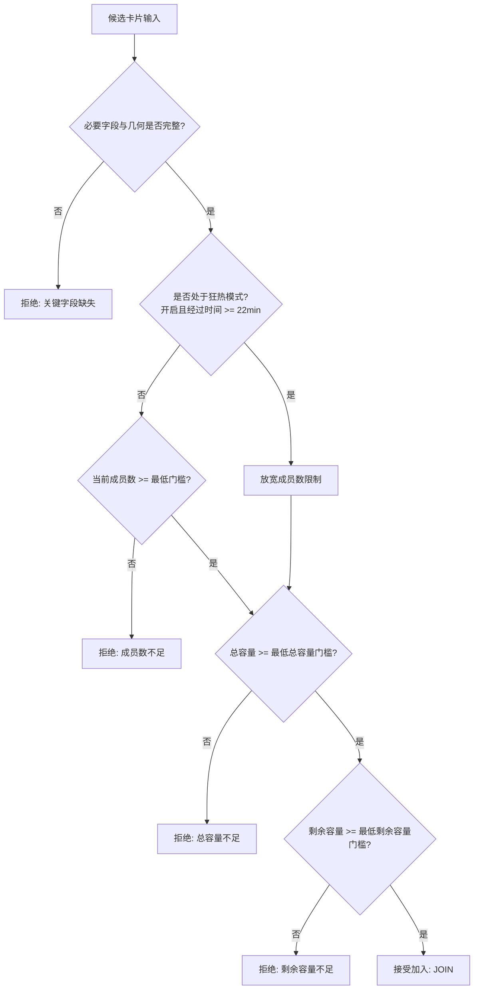
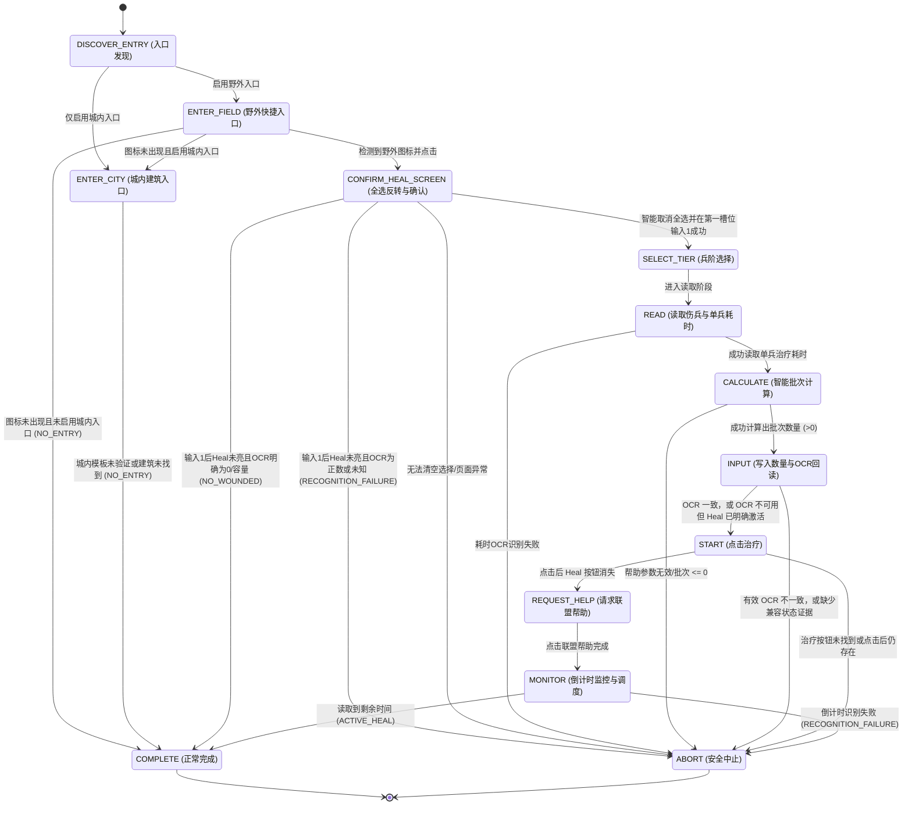

# 打熊筛选、医院治疗与运行时恢复完整实施计划

## 1. 计划概述与实施状态

本计划旨在 Frostguard 现有 Java 21/Maven 架构下完成三项核心能力升级：
1. **打熊集结高级筛选与出征闭环**：基于同帧动态相对 ROI 的卡片识别、多维度条件决策策略、狂热放宽模式、实例级分域 TTL 去重缓存、以及严格的出征部署与弹窗安全检测。
2. **医院智能批量治疗与防错回读**：野外快捷入口已接入；城内模板资源存在但等待真实帧复核。流程包含页面身份确认、全选反转、伤兵读取、精确与兼容批次计算、OCR 回读和有界调度。
3. **运行时异常取证与有界恢复**：结构化异常帧截取脱敏保存、队列级状态恢复与退避熔断。

**游戏界面范围**：本计划中的模板、OCR、保存帧和实机验证只支持英文游戏界面。中文及其他语言游戏界面不在本需求范围内，不得使用英文模板结果推断其可用性；该限制不影响 Frostguard 桌面程序自身的简体中文本地化功能。

### 1.1 当前实施状态矩阵

| 能力模块 | 实施状态 | 核心实现与验证证据 |
| --- | --- | --- |
| **普通打熊兼容加入** | ✅ 已保留 | 维持上游默认加号点击与出征流程，高级开关关闭时不改变原行为 |
| **打熊紧凑数值解析** | ✅ 已完成 | `CompactGameNumberParser` 支持整数、千分位、`K/M` 缩写与防溢出，带独立单元测试 |
| **打熊卡片扫描 (`BearRallyScanner`)** | ✅ 逻辑完成，待真实帧 | 单帧最多读取 8 个加号锚点；相邻重复命中合并，越界卡片丢弃；每张卡的 4 组相对 ROI 独立读取并有单元测试 |
| **打熊决策策略与狂热模式** | ✅ 已完成 | `BearRallyDecisionPolicy` 分别过滤成员数、总容量、剩余容量门槛；狂热模式在 22 分钟后自动放宽成员数门槛 |
| **打熊分域 TTL 去重缓存** | ✅ 已完成 | `BearRallyDedupCache` 复合签名去重，300 秒过期、256 条容量上限、时钟回拨安全重置，仅在出征成功后写入 |
| **打熊出征部署与弹窗安全闭环** | ✅ 逻辑完成，待实机 | 6 编队轮换；队列满/同目标拦截；Deploy 必须消失才登记成功 |
| **医院入口策略** | ⚠️ 部分完成 | WORLD 快捷图标已接入；城内模板资源存在但缺少真实帧验证，城内入口默认关闭且不盲点 |
| **医院全选状态智能反转** | ⚠️ 逻辑完成，待稳定模板 | 现有 Heal 模板含动态倒计时且尚无遮罩；流程保持保守退出，待真实帧制作稳定裁剪或 `_mask.png` 后再标记可用 |
| **伤兵总数读取与智能批次计算** | ✅ 已完成 | `HOSPITAL_WOUNDED_COUNT_OCR_AREA` 提取伤兵总数；`HealBatchCalculator` 支持精确模式 `[1, woundedCount]` 与兼容模式 |
| **数量输入 OCR 回读防错** | ✅ 已完成 | 有效 OCR 不一致时最多重试 2 次并中止；OCR 不可用时仅在 Heal 已激活的独立证据下走基础兼容路径 |
| **倒计时监控与调度重排** | ✅ 已完成 | 优先使用 `HOSPITAL_HEAL_TIME_OCR_AREA` 监控治疗剩余时间；根据退出结果（进行中/无伤兵/识别失败/配置不支持）精确重排 |
| **手动集结安全检查** | ✅ 已保留 | 绿色像素判定、出征数限制、Equalize 必须存在、阻断弹窗与 Deploy 消失确认 |
| **异常 PNG 取证** | ✅ 已接入 | 全帧像素化，metadata 最小化，成对写入；只对 `exception_*` 按 7 天/100 文件/50MiB 清理 |
| **医院加速安全分支** | ⏳ 待素材 | 配置项已预留，待获取加速弹窗真实素材后完成安全校验分支，目前在 UI 中安全禁用 |

---

## 2. 打熊高级加入系统设计

### 2.1 动态锚点扫描几何设计
打熊集结列表支持多卡片并存。`BearRallyScanner` 在同一帧画面中先使用 `TemplatesEnum.BEAR_JOIN_PLUS_ICON` 定位最多 8 个可用加号按钮，过滤无坐标、OCR 区域越界和 8px 内的重复命中，再按 $P_y$ 升序建立独立卡片。

匹配结果是模板中心点；有模板尺寸时先换算为匹配区域左上角 $(P_x, P_y)$。模板定位与后续 OCR 使用控制器同一缓存帧，再计算各字段区域：

| 字段名称 | X 范围 ($X_1 \sim X_2$) | Y 相对偏移 ($DY_1 \sim DY_2$) | 示例识别文本 | 解析结果 |
| --- | --- | --- | --- | --- |
| **发起人 (Host)** | $281 \sim 691$ | $-102 \sim -63$ | `LeaderName` | `LeaderName` |
| **成员数 (Members)** | $626 \sim 688$ | $-57 \sim -24$ | `3/6` | 当前成员: 3, 最大成员: 6 |
| **容量 (Capacity)** | $284 \sim 521$ | $-57 \sim -25$ | `50.0K/200.0K` | 剩余容量: 50,000, 总容量: 200,000 |
| **倒计时 (Countdown)** | $571 \sim 691$ | $-163 \sim -124$ | `04:30` | 剩余时长: 270 秒 |

推导兵量公式：
$$\text{currentTroops} = \text{totalCapacity} - \text{remainingCapacity}$$

每个候选保存加号模板的真实匹配矩形。决策通过后不会直接点击扫描时的中心坐标，而是在该矩形向外扩展 12px 的局部区域内重新匹配；目标已消失或列表已变化时跳过该候选，避免多卡片场景点击陈旧坐标。

### 2.2 决策策略与狂热模式
输入参数：`BearRallyCandidate`、用户配置项、活动基准开始时间 `referenceTrapTime`、系统时钟 `Clock`。

### 2.3 TTL 缓存与出征安全闭环
- **复合签名**：`host:members=X/Y:troops=A/B:remaining=C:completion=D`。
  - 其中 `completion` 为由采集时刻加剩余秒数推导出的 15 秒归一化时间桶：$\lfloor (T_{\text{now}} + T_{\text{countdown}}) / 15 \rfloor$。这样同一车在倒计时自然递减时，签名保持稳定，不会被误判为新车。
- **出征时序与弹窗拦截**：
  1. 候选严格保持扫描所得的从上到下顺序，不按容量字段二次排序；在候选保存的按钮矩形外扩 12px 后重新匹配加号，目标已变化时废弃整批候选并重新扫描；
  2. 调用 `marchHelper.selectFlag(selectedFlag)` 选择对应保存编队。若编队不存在则 `pressBack()` 并尝试下一候选；
  3. 搜索定位 `BEAR_DEPLOY_BUTTON`；若未找到则 `pressBack()` 返回并重新扫描，不继续使用旧候选；
  4. 点击 Deploy 按钮，等待 500ms；
  5. 弹窗安全检查：
     - 若触发 `deploymentHelper.isMarchQueueFull()`：说明队列已满，`pressBack()` 并中止本轮出征；
     - 若触发 `deploymentHelper.isSameTargetDialog()`：说明已有部队前往同一目标，`pressBack()` 两次关闭弹窗与出征页，继续评估下一个候选；
  6. 无弹窗后继续检查 Deploy 按钮已经消失；只有该正向证据成立才执行 `dedupCache.markJoined(scope, key)`。

---

## 3. 医院治疗状态机系统设计

### 3.1 状态转换图

### 3.2 关键步骤技术细节
1. **页面身份与兼容转换证据**：
   - 点击经过模板确认的医院入口后，只接受结构合法的伤兵 OCR（`当前值/容量`，且 `0 <= 当前值 <= 容量`、`容量 > 0`）或彩色 Heal 模板作为治疗页身份；
   - 入口图标消失只说明原入口不再可见，不能单独证明已经进入治疗页；
   - 没有医院页面强证据时进入 `ABORT`，不执行后续快速选择、输入框或治疗点击。
   - 稳定图标或按钮应作为锚点；数字、倒计时和数量角标必须从模板中裁掉，或通过同名 `_mask.png` 排除后再在锚点相对区域单独 OCR。当前 `hospital_heal_button.png` 包含动态倒计时且没有遮罩，因此相关高级流程仍需真实帧校准，不能把逻辑测试视为视觉可用证据。
2. **全选智能反转算法**：
   - 检查 `HOSPITAL_HEAL_BUTTON` 是否存在：
     - 若存在且阈值达标（按钮为彩色，表示游戏默认全选了伤兵）：点击快速选择切换点 `(134, 852)`，等待 1500ms；
     - 循环最多 3 次，直至治疗按钮变为灰色未激活状态；
     - 随后点击第一兵种输入框 `TROOP_1_INPUT_BOX_CENTER (590, 390)`，清除文本并写入 `1\n`，激活治疗按钮为可用状态。
3. **批次计算公式**：
   - 最大帮助总减免秒数：$$T_{\text{help}} = \text{helpCount} \times \text{reductionSec}$$
   - **精确批次**（当读取到 $\text{totalWounded} > 0$ 时）：
     $$\text{batchSize} = \max\left(1, \min\left(\text{totalWounded}, \left\lfloor \frac{T_{\text{help}}}{\text{singleTroopTimeSec}} \right\rfloor\right)\right)$$
   - **兼容批次**（当未能置信读取伤兵总数时）：
     $$\text{batchSize} = \max\left(1, \left\lfloor \frac{T_{\text{help}}}{\text{singleTroopTimeSec}} \right\rfloor\right)$$
4. **输入 OCR 回读校验**：
   - 写入目标批次数后，调用 `provider.extractText` 读取输入框 `[540, 360, 640, 420]`。
   - 解析文本数值，若 $\text{readBackVal} == \text{batchedAmountToHeal}$，标记校验通过并进入 `START`；
   - 有效数值不匹配时最多重试 2 次，仍不匹配则 `ABORT`；OCR 无有效数值时，仅在 Heal 按钮已经激活时走基础兼容路径。
5. **调度重排策略矩阵 (`HospitalSchedulePolicy`)**：

| 退出状态 (`Outcome`) | 重排延迟 | 业务理由 |
| --- | --- | --- |
| `ACTIVE_HEAL` | 剩余秒数 + 30s 缓冲（无倒计时则回退 15 分钟） | 治疗进行中，等待本批治疗完成并利用完联盟帮助后准时执行下一批 |
| `NO_WOUNDED` | 正常轮询（由调度器接管） | 医院无伤兵，无需频繁重试 |
| `NO_ENTRY` | 正常轮询（由调度器接管） | 野外快捷图标未达阈值或城内不可见，等待下个周期 |
| `RECOGNITION_FAILURE` | 15 分钟固定退避 | 视觉识别或输入回读异常，防止死循环刷屏 |
| `CONFIGURATION_UNSUPPORTED`| 1 小时长退避 | 配置异常（如两个入口均关闭或参数错误），避免无效运行 |

---

## 4. 自动化测试与验证证据

### 4.1 测试用例覆盖清单
| 测试类 | 覆盖模块 | 测试要点 |
| --- | --- | --- |
| `BearRallyScannerTest` | 打熊扫描器 | 空列表、多候选排序、多结果上限、重复命中合并、越界过滤、模板顶部锚定、ROI 与数值转换、真实按钮矩形保留 |
| `BearRallyCandidateTest` | 打熊候选模型 | 倒计时自然衰减时复合签名的稳定性 |
| `BearRallyDecisionPolicyTest` | 打熊决策策略 | 成员数门槛、总容量门槛、剩余容量门槛、狂热模式放宽、非法数值防御 |
| `BearRallyDedupCacheTest` | 打熊去重缓存 | 活动实例隔离、300 秒 TTL、LRU、60 秒回拨容差 |
| `HealBatchCalculatorTest` | 医院批次计算 | 精确模式伤兵截断、兼容模式计算、超大数值防溢出、非法耗时保护 |
| `HospitalPageEvidencePolicyTest` | 医院页面证据策略 | 合法/非法伤兵结构、页面强证据、明确零伤兵与识别失败分类 |
| `HospitalSchedulePolicyTest` | 医院调度策略 | 进行中时间加缓冲重排、识别失败退避、无伤兵轮询、非法配置长延迟 |
| `ManualRallyJoinRoutineTest` | 手动集结 | 编队范围与部署正向确认策略 |

### 4.2 编译与测试运行证据
- **运行命令**：本机 Maven 3.9.16 执行受影响模块测试；当前 PowerShell 下 Maven Wrapper 自身启动失败。
- **执行环境**：Java 21 (Temurin-21.0.12), Windows 11 PowerShell
- **运行结果**：
  - `frostguard-api`: SUCCESS
  - `frostguard-persistence`: SUCCESS
  - `frostguard-vision`: SUCCESS
  - `frostguard-automation`: SUCCESS
  - `frostguard-tasks`: SUCCESS
  - 合并 `upstream/main@24795a0` 后，`modules/desktop -am test` 完整通过；Surefire 报告合计 594 个测试，0 失败、0 错误、0 跳过。
  - 多卡片扫描修复后，打熊扫描、候选、决策和去重定向测试共 17 个通过；随后 tasks Reactor 回归在排除当前 Windows 进程环境下会读取空 PID 的既有 `BoundedProcessRunnerTest` 后，共 440 个测试通过，0 失败、0 错误、0 跳过。
  - 医院页面证据收紧后，`HospitalPageEvidencePolicyTest`、`HealBatchCalculatorTest` 和 `HospitalSchedulePolicyTest` 共 19 个定向测试通过；同条件下 tasks Reactor 共 444 个测试通过，0 失败、0 错误、0 跳过。
  - 打熊旧坐标失效修复后，打熊扫描、候选、决策和去重共 20 个定向测试通过；同条件下 tasks Reactor 共 447 个测试通过，0 失败、0 错误、0 跳过。
  - 去重碰撞和医院调度边界补齐后，打熊与医院策略共 45 个定向测试通过；同条件下 tasks Reactor 共 453 个测试通过，0 失败、0 错误、0 跳过。
  - 医院关闭态零交互与模板默认值测试加入后，tasks Reactor 共 456 个测试通过，0 失败、0 错误、0 跳过；医院未支持控件和模板映射定向测试另有 28 个通过。
  - 两轮修复及第三、第四轮复审后，tasks Reactor 共 460 个测试通过，0 失败、0 错误、0 跳过；FXML 资源、控制器绑定和医院禁用状态共 6 个定向测试通过。
  - 仍缺少 `720x1280` 未缩放真实帧与实机日志，高级打熊和医院不能标记为实机验证完成。

### 4.3 下一步真实画面证据清单

- [ ] 打熊联盟集结列表：至少同时显示两个可加入卡片，并清楚显示成员数、总容量、剩余容量和倒计时。
- [ ] 野外 WORLD 完整画面：野外快捷医院图标可见，用于复核入口模板和点击后的页面转换。
- [ ] 点击野外快捷医院图标后的完整治疗界面：伤兵数、数量框、治疗时间和 Heal 按钮区域可见。
- [ ] 城内 HOME 完整画面：医院建筑完整可见，用于复核或重制尚未通过真实帧验证的城内入口模板。
- [ ] 点击城内医院后的完整治疗界面：用于确认城内入口结果是否与野外治疗页一致。
- [ ] 治疗开始并请求联盟帮助后的完整页面：帮助状态或剩余倒计时可见。
- [ ] 确认游戏使用英文界面。图片必须是未经裁剪、缩放的原始 PNG；玩家名和联盟名可以脱敏，但不得遮挡按钮、数值和 OCR 区域。

---

## 5. 分阶段实施待办与验收门禁

本节是后续实施的唯一执行顺序。状态含义：`[ ]` 未开始、`[-]` 已有逻辑但证据不足、`[x]` 已满足本阶段验收。不得因为代码存在就把真实帧或实机项目标记完成。

### 5.1 全程必须遵守的安全门禁

- [ ] 每次开始前确认普通打熊加入、其他城市任务和调度器基线可运行；高级开关关闭时不得改变原行为。
- [ ] 打熊和医院高级识别仅针对英文游戏界面制作模板、配置 OCR 和记录验证证据；不得宣称支持中文或其他语言游戏界面。
- [ ] 一次只完善一个可独立验证的视觉动作，禁止同时猜测多个模板、坐标和页面转换。
- [ ] 所有模板点击使用实际匹配矩形；固定坐标只能作为已确认锚点的相对偏移，不能作为未知页面的盲点兜底。
- [ ] 模板只包含稳定图形。数量、倒计时、红点、玩家信息等动态内容必须裁掉或由 `_mask.png` 排除，并在相对区域单独 OCR。
- [ ] OCR 的 `null`、空白、非法格式、溢出和区域越界均视为未知状态；未知状态安全退出，不自动代入危险默认值。
- [ ] 每个循环都有次数或时间上限；每个失败出口都有明确结果、日志和下一次调度策略。
- [ ] 出征、治疗、使用加速等有副作用动作必须有点击前证据和点击后页面转换证据。
- [ ] 高级路径失败只能跳过本次高级动作，不得禁用、覆盖或破坏普通兼容路径。
- [ ] 每次代码变更同步更新本计划和 `docs/custom-features.md`，写明自动化、真实帧、实机日志三类证据的实际完成情况。

### 5.2 第一批——阶段 0：无需真实图片的安全修复

本阶段只收紧错误状态和危险兜底，不猜测游戏字段含义、不新增模板、不开放城内医院或加速功能。每个小批次单独修改、测试和记录，完成一个再进入下一个。

#### 5.2.1 医院页面身份与结果分类

- [x] 移除“入口模板消失即可单独证明进入治疗页”的弱兜底；没有医院页面强证据时不得执行快速选择、输入框或治疗点击。
- [x] 合法 OCR 在页面确认阶段明确为 `0/容量` 时立即返回 `NO_WOUNDED`，不会执行快速选择或数量输入；输入 `1` 后只有再次明确为零才返回无伤兵，正数或未知状态返回 `RECOGNITION_FAILURE`。
- [x] 为页面证据不足、明确无伤兵、模板失效和 OCR 异常增加 `HospitalPageEvidencePolicyTest` 纯逻辑测试。
- [x] `HospitalHealRoutineTest` 使用未连接的测试设备直接执行关闭状态，验证总开关关闭时在任何截图、OCR、导航或触屏操作之前安全返回。

完成门禁：相关定向测试通过；在没有真实图片时只证明“错误状态不会危险点击”，不声明医院流程可用。

#### 5.2.2 打熊候选顺序与旧坐标失效

- [x] 在容量 `A/B` 语义确认前取消按 `remainingCapacity` 排序，保持扫描得到的从上到下稳定顺序。
- [x] 非法或未知数值由 `BearRallyDecisionPolicy` 拒绝，不再通过容量排序进入优先候选。
- [x] 候选局部复核失败或页面往返后立即废弃当前候选集合，最多重新截图扫描 3 次，不继续使用其他旧坐标。
- [x] `BearRallyScannerTest` 覆盖容量方向不影响屏幕顺序、候选消失、相邻卡片顶替和新扫描只返回当前帧候选。

完成门禁：高级路径不能因未知容量含义改变选择方向；任何页面往返后都不使用旧截图中的卡片坐标。

#### 5.2.3 多卡片去重与隐私边界

- [x] 同一发起人字段完全相同的同帧候选不进入 300 秒复合签名去重，改用“签名+屏幕纵坐标”的 5 秒短期抑制；所有明确同目标弹窗也进入该短期缓存，不会冒充成功部署或长期漏掉另一辆。
- [x] 去重键只在内存中使用；日志只记录卡片纵坐标和决策原因，不输出发起人、联盟名或完整候选签名。
- [x] 只有 Deploy 消失且没有阻断弹窗时才写入 300 秒成功缓存；扫描、策略拒绝、页面失败和普通阻断弹窗不占用成功记录。完全同签名成功候选及明确同目标仅写入独立的 5 秒位置抑制缓存。
- [x] `BearRallyDedupCacheTest` 覆盖签名碰撞、位置键隔离、不同发起人/完成时间、活动实例隔离、TTL、LRU 和时钟回拨；编队轮换只在局部按钮复核成功后推进。

完成门禁：去重不会漏掉另一辆合法集结，也不会因失败尝试阻止后续正常加入。

#### 5.2.4 未支持医院能力的 UI 与模板边界

- [x] 已核对 `HOSPITAL_CITY_BUILDING`、`HOSPITAL_HELP_BUTTON`、`HOSPITAL_CONFIRM_BUTTON` 和 `HOSPITAL_CANCEL_BUTTON`：均未注册为可用模板；城内图片文件即使存在，也不会在真实帧验证前被运行时加载。
- [x] 城内医院在 FXML 和控制器中均禁用并标记等待验证；运行时另有硬门禁，会忽略旧配置中残留的 `true`，不进入城内模板搜索。
- [x] 治疗加速 UI 保持禁用，直到阶段 F 的库存道具与付费边界全部验证。
- [x] `TemplatesEnumTest` 锁定未注册模板和危险配置默认值；`HospitalUnsupportedFeaturesTest` 锁定城内医院/加速禁用且野外入口可用；`FxmlLoadabilityTest` 只验证布局资源存在，FXML 与控制器字段绑定另由 `FxmlControllerBindingTest` 结构检查覆盖。

完成门禁：用户无法从 UI 打开尚未验证的危险分支；野外基础入口和其他医院配置仍可正常保存。

### 5.3 第二批——阶段 A：素材接收与隐私检查

- [ ] 只接收英文游戏界面的 `720x1280`、未经缩放和裁剪的 PNG；非英文素材不进入本需求的模板或 OCR 校准流程。
- [ ] 检查图片未包含需要保密的玩家名、联盟名、账号 ID、聊天或设备信息；脱敏不得遮挡目标按钮、数字和 OCR 区域。
- [ ] 为每张图片登记页面状态：WORLD/HOME、入口点击前后、是否有伤兵、按钮启用状态、治疗中状态。
- [ ] 同一动态模板至少收集 3 个不同数值或倒计时状态，用于证明模板没有依赖某一个数字。
- [ ] 素材只进入受影响模块的 `src/test/resources`；禁止提交原始日志、工作区数据或未脱敏截图。

验收门禁：素材尺寸、状态和隐私均确认；任何关键页面缺失时，只推进不依赖该页面的阶段。

### 5.4 阶段 B：打熊多卡片真实帧校准

- [-] 在单帧中搜索最多 8 个 `BEAR_JOIN_PLUS_ICON`，过滤无效、越界和 8px 内重复命中。
- [ ] 用至少一张同时包含两个可加入卡片的真实帧验证匹配数量、中心点、模板尺寸和从上到下顺序。
- [ ] 绘制或输出每张卡的发起人、成员、容量和倒计时 ROI，确认没有跨到相邻卡片。
- [ ] 验证顶部半截卡、底部半截卡、列表空白和相似加号不会生成可加入候选。
- [ ] 使用成员数 `X/Y`、容量 `A/B` 和倒计时格式作为卡片内部一致性证据；关键字段缺失时拒绝候选。
- [ ] 比较多个候选的排序规则，确认剩余容量相同时保持稳定顺序，不因 OCR 失败把 `-1` 排到最前并误选。
- [ ] 点击前在原匹配矩形外扩 12px 的局部区域重新搜索；目标消失、移动或被遮挡时跳过并重新扫描。

验收门禁：保存帧测试能稳定区分所有可加入卡片，且每张卡的字段来自自己的 ROI；尚未实机点击时仍标记“真实帧通过、实机未验证”。

### 5.5 阶段 C：打熊出征闭环实机验证

- [ ] 验证选中候选后进入正确的编队页面，而不是相邻卡片或其他弹窗。
- [ ] 分别验证保存编队存在、不存在、队列已满和同目标弹窗四种分支。
- [ ] 验证 Deploy 未出现时安全返回；Deploy 点击后仍存在时不得登记成功。
- [ ] 验证只有 Deploy 消失且无阻断弹窗时才写入去重缓存和轮换编队。
- [ ] 验证失败返回列表后不会继续点击旧候选坐标；需要下一候选时必须重新确认或重新扫描。
- [ ] 验证高级开关关闭后仍走原作者普通加入流程，并对比运行日志确认没有额外 OCR 或点击。

验收门禁：保存帧测试、自动化测试和脱敏实机日志均通过；失败场景未产生错误出征或虚假成功记录。

### 5.6 阶段 D：医院稳定模板与页面身份

- [ ] 重新处理 `hospital_heal_button.png`：裁掉动态倒计时，或增加同尺寸 `hospital_heal_button_mask.png` 排除倒计时区域。
- [ ] 使用至少 3 个不同倒计时/治疗数量状态验证新模板，记录彩色、灰色和不可见状态的分数分布后确定阈值。
- [ ] 校验 WORLD 快捷入口模板在不同背景、动画和无入口状态下的命中与误命中。
- [ ] 校验城内医院模板资源来自有效原始帧；未通过真实帧验证前保持城内入口默认关闭。
- [ ] 治疗页身份至少需要两个互补证据中的一个强证据：稳定页面模板，或伤兵数量结构加入口消失的组合证据。
- [ ] 页面身份不成立时不得执行快速选择、输入框、治疗或帮助按钮动作。

验收门禁：动态数字变化不影响稳定模板；错误页面和灰色状态不会被判成可治疗页面。

### 5.7 阶段 E：医院相对定位与 OCR

- [ ] 选择经真实帧验证的稳定锚点，并测量快速选择、第一兵种输入框、伤兵数、治疗时间和空白收键盘区域的相对矩形。
- [ ] 将可替换的固定点改为锚点相对区域；每个推导区域在点击或 OCR 前执行屏幕边界校验。
- [ ] OCR 数量只允许数字和合法 `K/M`/千分位格式；倒计时只接受项目时间解析器认可的格式。
- [ ] 验证全选清零最多 3 次，按钮状态没有转换时中止，不能循环点击。
- [ ] 输入 `1` 后必须出现可治疗证据；没有伤兵与识别失败必须通过证据区分，不能统一当作成功或无伤兵。
- [ ] 批次数量写入后回读必须完全一致；有效但不一致最多重试 2 次，未知 OCR 只有在独立按钮证据成立时才能走兼容路径。
- [ ] 治疗开始后验证 Heal 状态消失或转换，再尝试联盟帮助；剩余时间失败时按 15 分钟退避，不高频重试。

验收门禁：所有相对区域由真实帧测量并有保存帧测试；未完成实机日志前保持“逻辑与真实帧通过、实机未验证”。

### 5.8 阶段 F：城内入口与加速道具

- [ ] 城内入口只有在建筑模板、点击后治疗页身份和返回路径全部验证后才能开放配置。
- [ ] 加速弹窗先定位稳定道具图标，再从图标匹配矩形推导数量区域；动态数量不参与图标模板匹配。
- [ ] 区分免费/道具支付与钻石、现金或其他付费入口；无法证明为允许的库存道具时禁止确认。
- [ ] OCR 确认可用道具数量、单个时长和将使用数量，计算结果不得超过库存及 `HOSPITAL_HEAL_MAX_SPEEDUP_MINUTES_INT`。
- [ ] 使用加速前后二次读取剩余时间，只有时间按预期下降才记录成功；弹窗、扣费类型或时间变化异常立即中止。
- [ ] 加速分支未通过全部验收前保持 UI 禁用；基础分批治疗不依赖加速分支。

验收门禁：零付费误触、零超量使用，并具有不同库存数量、无库存和付费提示的保存帧与实机证据。

### 5.9 阶段 G：异常恢复、回归与交付

- [ ] 为模板缺失、OCR 失败、页面不符、输入不一致、阻断弹窗和超时分别记录可区分的结果及退避原因。
- [ ] 异常截图继续执行全帧脱敏、metadata 最小化和容量清理；测试素材不得泄露账号信息。
- [ ] 运行打熊、医院、手动集结、调度和异常取证定向测试，再运行受影响 Reactor 回归。
- [ ] 重新验证高级开关全部关闭时，普通打熊、普通城市任务和调度周期没有行为变化。
- [ ] 对照 `docs/custom-features.md` 逐项确认配置键、UI、模板、持久化、调度、日志和测试均未丢失。
- [ ] 汇总自动化测试、保存帧和实机日志证据；未完成项继续保留 `[ ]`，不得用“编译通过”替代行为验证。

最终完成条件：阶段 0 至 G 的适用项目全部满足；真实帧与实机缺失项明确保留；基础功能回归通过；文档和代码状态一致。

### 5.10 分次执行与续接规则

- 每次只选择阶段 0 的一个小批次，或后续阶段的一组紧密相关复选项，不跨阶段混合修改。
- 开始时记录本次目标、涉及文件和基础功能保护点；结束时更新复选框、实际测试、证据等级、失败项和下一入口。
- 未完成的小批次保持 `[-]`，注明已完成部分和明确阻塞条件；不得为了显示完成而降低验收门禁。
- 每次代码变更同步更新 `docs/custom-features.md`；未提交的工作区改动也必须在下一次继续前重新检查。
- 第一批从 `5.2.1 医院页面身份与结果分类` 开始，依次完成 `5.2.2`、`5.2.3`、`5.2.4`。
- 第一批全部完成后等待英文素材，进入阶段 A 和 B。用户首先提供“一张同时显示至少两个可加入集结卡片的完整原始 PNG”；收到后只做离线框选和保存帧测试，不直接实机点击。
