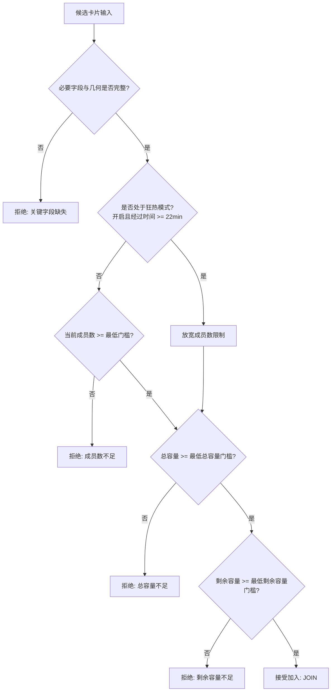
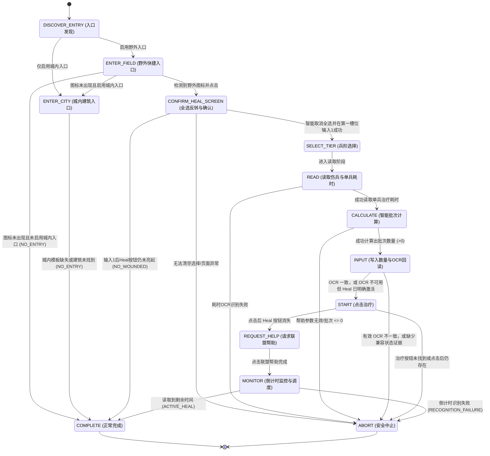

# 打熊筛选、医院治疗与运行时恢复完整实施计划

## 1. 计划概述与实施状态

本计划旨在 Frostguard 现有 Java 21/Maven 架构下完成三项核心能力升级：
1. **打熊集结高级筛选与出征闭环**：基于同帧动态相对 ROI 的卡片识别、多维度条件决策策略、狂热放宽模式、实例级分域 TTL 去重缓存、以及严格的出征部署与弹窗安全检测。
2. **医院智能批量治疗与防错回读**：野外快捷入口已接入；城内入口等待真实模板。流程包含页面身份确认、全选反转、伤兵读取、精确与兼容批次计算、OCR 回读和有界调度。
3. **运行时异常取证与有界恢复**：结构化异常帧截取脱敏保存、队列级状态恢复与退避熔断。

### 1.1 当前实施状态矩阵

| 能力模块 | 实施状态 | 核心实现与验证证据 |
| --- | --- | --- |
| **普通打熊兼容加入** | ✅ 已保留 | 维持上游默认加号点击与出征流程，高级开关关闭时不改变原行为 |
| **打熊紧凑数值解析** | ✅ 已完成 | `CompactGameNumberParser` 支持整数、千分位、`K/M` 缩写与防溢出，带独立单元测试 |
| **打熊卡片扫描 (`BearRallyScanner`)** | ✅ 逻辑完成，待真实帧 | 模板匹配后 OCR 复用同一缓存帧；匹配中心按模板尺寸换算为左上角锚点；4 组相对 ROI 有单元测试 |
| **打熊决策策略与狂热模式** | ✅ 已完成 | `BearRallyDecisionPolicy` 分别过滤成员数、总容量、剩余容量门槛；狂热模式在 22 分钟后自动放宽成员数门槛 |
| **打熊分域 TTL 去重缓存** | ✅ 已完成 | `BearRallyDedupCache` 复合签名去重，300 秒过期、256 条容量上限、时钟回拨安全重置，仅在出征成功后写入 |
| **打熊出征部署与弹窗安全闭环** | ✅ 逻辑完成，待实机 | 6 编队轮换；队列满/同目标拦截；Deploy 必须消失才登记成功 |
| **医院入口策略** | ⚠️ 部分完成 | WORLD 快捷图标已接入；`HOSPITAL_CITY_BUILDING` 缺少真实模板，城内入口保持不支持且不盲点 |
| **医院全选状态智能反转** | ✅ 已完成 | 循环检测 Heal 按钮状态，若亮起则点击快速选择 `(134, 852)` 清零所有兵种选择，输入 1 激活治疗按钮 |
| **伤兵总数读取与智能批次计算** | ✅ 已完成 | `HOSPITAL_WOUNDED_COUNT_OCR_AREA` 提取伤兵总数；`HealBatchCalculator` 支持精确模式 `[1, woundedCount]` 与兼容模式 |
| **数量输入 OCR 回读防错** | ✅ 已完成 | 有效 OCR 不一致时最多重试 2 次并中止；OCR 不可用时仅在 Heal 已激活的独立证据下走基础兼容路径 |
| **倒计时监控与调度重排** | ✅ 已完成 | 优先使用 `HOSPITAL_HEAL_TIME_OCR_AREA` 监控治疗剩余时间；根据退出结果（进行中/无伤兵/识别失败/配置不支持）精确重排 |
| **手动集结安全检查** | ✅ 已保留 | 绿色像素判定、出征数限制、Equalize 必须存在、阻断弹窗与 Deploy 消失确认 |
| **异常 PNG 取证** | ✅ 已接入 | 全帧像素化，metadata 最小化，成对写入；只对 `exception_*` 按 7 天/100 文件/50MiB 清理 |
| **医院加速安全分支** | ⏳ 待素材 | 配置项已预留，待获取加速弹窗真实素材后完成安全校验分支，目前在 UI 中安全禁用 |

---

## 2. 打熊高级加入系统设计

### 2.1 动态锚点扫描几何设计
打熊集结列表支持多卡片并存。`BearRallyScanner` 在同一帧画面中先使用 `TemplatesEnum.BEAR_JOIN_PLUS_ICON` 模板定位所有可用加号按钮坐标 $(P_x, P_y)$，并按 $P_y$ 升序排序。

匹配结果是模板中心点；有模板尺寸时先换算为匹配区域左上角 $(P_x, P_y)$。模板定位与后续 OCR 使用控制器同一缓存帧，再计算各字段区域：

| 字段名称 | X 范围 ($X_1 \sim X_2$) | Y 相对偏移 ($DY_1 \sim DY_2$) | 示例识别文本 | 解析结果 |
| --- | --- | --- | --- | --- |
| **发起人 (Host)** | $281 \sim 691$ | $-102 \sim -63$ | `LeaderName` | `LeaderName` |
| **成员数 (Members)** | $626 \sim 688$ | $-57 \sim -24$ | `3/6` | 当前成员: 3, 最大成员: 6 |
| **容量 (Capacity)** | $284 \sim 521$ | $-57 \sim -25$ | `50.0K/200.0K` | 剩余容量: 50,000, 总容量: 200,000 |
| **倒计时 (Countdown)** | $571 \sim 691$ | $-163 \sim -124$ | `04:30` | 剩余时长: 270 秒 |

推导兵量公式：
$$\text{currentTroops} = \text{totalCapacity} - \text{remainingCapacity}$$

### 2.2 决策策略与狂热模式
输入参数：`BearRallyCandidate`、用户配置项、活动基准开始时间 `referenceTrapTime`、系统时钟 `Clock`。

### 2.3 TTL 缓存与出征安全闭环
- **复合签名**：`host:members=X/Y:troops=A/B:remaining=C:completion=D`。
  - 其中 `completion` 为由采集时刻加剩余秒数推导出的 15 秒归一化时间桶：$\lfloor (T_{\text{now}} + T_{\text{countdown}}) / 15 \rfloor$。这样同一车在倒计时自然递减时，签名保持稳定，不会被误判为新车。
- **出征时序与弹窗拦截**：
  1. 点击加号按钮 `candidate.joinButtonPoint()`，等待 500ms；
  2. 调用 `marchHelper.selectFlag(selectedFlag)` 选择对应保存编队。若编队不存在则 `pressBack()` 并尝试下一候选；
  3. 搜索定位 `BEAR_DEPLOY_BUTTON`；若未找到则 `pressBack()` 退出；
  4. 点击 Deploy 按钮，等待 500ms；
  5. 弹窗安全检查：
     - 若触发 `deploymentHelper.isMarchQueueFull()`：说明队列已满，`pressBack()` 并中止本轮出征；
     - 若触发 `deploymentHelper.isSameTargetDialog()`：说明已有部队前往同一目标，`pressBack()` 两次关闭弹窗与出征页，继续评估下一个候选；
  6. 无弹窗后继续检查 Deploy 按钮已经消失；只有该正向证据成立才执行 `dedupCache.markJoined(scope, key)`。

---

## 3. 医院治疗状态机系统设计

### 3.1 状态转换图

### 3.2 关键步骤技术细节
1. **页面身份与兼容转换证据**：
   - 点击经过模板确认的医院入口后，优先使用伤兵区域 OCR 或彩色 Heal 模板确认治疗页；
   - 两项视觉证据暂时不可用时，只有“已确认的医院入口图标在点击后消失”才能作为基础兼容转换证据；
   - 无任何身份或转换证据时进入 `ABORT`，不执行后续固定区域点击。
2. **全选智能反转算法**：
   - 检查 `HOSPITAL_HEAL_BUTTON` 是否存在：
     - 若存在且阈值达标（按钮为彩色，表示游戏默认全选了伤兵）：点击快速选择切换点 `(134, 852)`，等待 1500ms；
     - 循环最多 3 次，直至治疗按钮变为灰色未激活状态；
     - 随后点击第一兵种输入框 `TROOP_1_INPUT_BOX_CENTER (590, 390)`，清除文本并写入 `1\n`，激活治疗按钮为可用状态。
3. **批次计算公式**：
   - 最大帮助总减免秒数：$$T_{\text{help}} = \text{helpCount} \times \text{reductionSec}$$
   - **精确批次**（当读取到 $\text{totalWounded} > 0$ 时）：
     $$\text{batchSize} = \max\left(1, \min\left(\text{totalWounded}, \left\lfloor \frac{T_{\text{help}}}{\text{singleTroopTimeSec}} \right\rfloor\right)\right)$$
   - **兼容批次**（当未能置信读取伤兵总数时）：
     $$\text{batchSize} = \max\left(1, \left\lfloor \frac{T_{\text{help}}}{\text{singleTroopTimeSec}} \right\rfloor\right)$$
4. **输入 OCR 回读校验**：
   - 写入目标批次数后，调用 `provider.extractText` 读取输入框 `[540, 360, 640, 420]`。
   - 解析文本数值，若 $\text{readBackVal} == \text{batchedAmountToHeal}$，标记校验通过并进入 `START`；
   - 有效数值不匹配时最多重试 2 次，仍不匹配则 `ABORT`；OCR 无有效数值时，仅在 Heal 按钮已经激活时走基础兼容路径。
5. **调度重排策略矩阵 (`HospitalSchedulePolicy`)**：

| 退出状态 (`Outcome`) | 重排延迟 | 业务理由 |
| --- | --- | --- |
| `ACTIVE_HEAL` | 剩余秒数 + 30s 缓冲（无倒计时则回退 15 分钟） | 治疗进行中，等待本批治疗完成并利用完联盟帮助后准时执行下一批 |
| `NO_WOUNDED` | 正常轮询（由调度器接管） | 医院无伤兵，无需频繁重试 |
| `NO_ENTRY` | 正常轮询（由调度器接管） | 野外快捷图标未达阈值或城内不可见，等待下个周期 |
| `RECOGNITION_FAILURE` | 15 分钟固定退避 | 视觉识别或输入回读异常，防止死循环刷屏 |
| `CONFIGURATION_UNSUPPORTED`| 1 小时长退避 | 配置异常（如两个入口均关闭或参数错误），避免无效运行 |

---

## 4. 自动化测试与验证证据

### 4.1 测试用例覆盖清单
| 测试类 | 覆盖模块 | 测试要点 |
| --- | --- | --- |
| `BearRallyScannerTest` | 打熊扫描器 | 空列表、排序、模板中心换算左上角、ROI 与数值转换 |
| `BearRallyCandidateTest` | 打熊候选模型 | 倒计时自然衰减时复合签名的稳定性 |
| `BearRallyDecisionPolicyTest` | 打熊决策策略 | 成员数门槛、总容量门槛、剩余容量门槛、狂热模式放宽、非法数值防御 |
| `BearRallyDedupCacheTest` | 打熊去重缓存 | 活动实例隔离、300 秒 TTL、LRU、60 秒回拨容差 |
| `HealBatchCalculatorTest` | 医院批次计算 | 精确模式伤兵截断、兼容模式计算、超大数值防溢出、非法耗时保护 |
| `HospitalSchedulePolicyTest` | 医院调度策略 | 进行中时间加缓冲重排、识别失败退避、无伤兵轮询、非法配置长延迟 |
| `ManualRallyJoinRoutineTest` | 手动集结 | 编队范围与部署正向确认策略 |

### 4.2 编译与测试运行证据
- **运行命令**：本机 Maven 3.9.16 执行受影响模块测试；当前 PowerShell 下 Maven Wrapper 自身启动失败。
- **执行环境**：Java 21 (Temurin-21.0.12), Windows 11 PowerShell
- **运行结果**：
  - `frostguard-api`: SUCCESS
  - `frostguard-persistence`: SUCCESS
  - `frostguard-vision`: SUCCESS
  - `frostguard-automation`: SUCCESS
  - `frostguard-tasks`: SUCCESS
  - 合并 `upstream/main@24795a0` 后，`modules/desktop -am test` 完整通过；Surefire 报告合计 594 个测试，0 失败、0 错误、0 跳过。
  - 仍缺少 `720x1280` 未缩放真实帧与实机日志，高级打熊和医院不能标记为实机验证完成。

### 4.3 下一步真实画面证据清单

- [ ] 打熊联盟集结列表：至少同时显示两个可加入卡片，并清楚显示成员数、总容量、剩余容量和倒计时。
- [ ] 野外 WORLD 完整画面：野外快捷医院图标可见，用于复核入口模板和点击后的页面转换。
- [ ] 点击野外快捷医院图标后的完整治疗界面：伤兵数、数量框、治疗时间和 Heal 按钮区域可见。
- [ ] 城内 HOME 完整画面：医院建筑完整可见，用于制作当前缺失的城内入口模板。
- [ ] 点击城内医院后的完整治疗界面：用于确认城内入口结果是否与野外治疗页一致。
- [ ] 治疗开始并请求联盟帮助后的完整页面：帮助状态或剩余倒计时可见。
- [ ] 说明游戏界面语言。图片必须是未经裁剪、缩放的原始 PNG；玩家名和联盟名可以脱敏，但不得遮挡按钮、数值和 OCR 区域。
